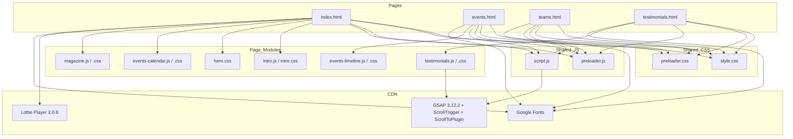

# NSS TSEC Mumbai — National Service Scheme

> **NOTE — this document was auto-generated during Session 1 from the *original static* codebase.
> The project has since become data-driven (Sessions 2–5). The **canonical README is
> `README.md`** — treat this file as a historical/technical deep-dive only. For the current
> architecture, data layer, and CMS, see `README.md`, `docs/ARCHITECTURE.md`, `docs/DATA_SCHEMA.md`,
> and `docs/ADMIN_GUIDE.md`.**

A premium, cinematic, **static multi-page website** for the **National Service Scheme (NSS)** unit of **Thakur Shyamnarayan Engineering College (TSEC), Mumbai**. The site showcases the unit's events, leadership team, volunteer testimonials, and a custom interactive 3D magazine — all built with plain HTML5, CSS3, and vanilla JavaScript, enhanced with **GSAP / ScrollTrigger** scroll animations and **Lottie** vector animations.

> **Updated for the current build:** the site is now **data-driven** — all content lives in
> `data/` as JSON (single source of truth), is read at runtime by the renderers, and is edited
> through the **Sveltia CMS admin** at `/admin/`. See `README.md` for the current overview.

This documentation was **generated automatically** from the actual source files. The original repository is [Bhavesh1411/NSS-Website](https://github.com/Bhavesh1411/NSS-Website).

---

## ✨ Key Features

| Feature | Description |
| --- | --- |
| **Cinematic Intro** | Homepage-only, once-per-session animated intro (logo roll-in, typewriter text, curtain exit) — `intro.js` / `intro.css`. |
| **Preloader & Offline screen** | Spinning logo + progress bar on every page; auto-detects offline state — `preloader.js` / `preloader.css`. |
| **Hero Slider** | Full-screen cross-fading image slider with Ken Burns effect, arrows, dots, autoplay — `hero.css` + `script.js:L52`. |
| **About NSS** | Two-column "Who We Are" section with animated logo and Lottie accent. |
| **Objectives** | 4-card grid with slide-up hover overlays and scroll-triggered entrance. |
| **Events (Home)** | Event grid for the active academic year (2026-27) — rendered from `data/events/2026-27/` by `renderHome.js`. |
| **Events (Timeline)** | `events.html` — interactive horizontal timeline grouped by month, with category filter chips, live search, an "All Events" data table, and an image lightbox. Fully data-driven from `data/events/2025-26/` + `data/events/2026-27/` — `events-timeline.js`. |
| **Events (Calendar)** | Homepage archive tab (currently hidden) — a navigable month calendar widget with event-day highlights and detail panel — `events-calendar.js` (reads `data/events/2025-26/`). |
| **3D Magazine Viewer** | Custom full-screen interactive book: CSS 3D page-flip with drag, click, keyboard, and touch support — `magazine.js` / `magazine.css`. |
| **Teams / Leadership** | Faculty advisors, five-frame faculty grid, leadership row, infinite marquee slideshow for the council, and a core-committee table — `teams.html` + `style.css`. |
| **Testimonials** | Card grid + GSAP-staggered entrance + reusable animated modal — `testimonials.html` / `testimonials.js` / `testimonials.css`. |
| **Lottie accents** | Decorative background animations (heart, plant, flag) loaded from LottieFiles CDN. |
| **Responsive design** | Media queries across all stylesheets; grid layouts collapse on tablet/mobile. |
| **Reduced-motion support** | `@media (prefers-reduced-motion: reduce)` blocks throughout CSS and JS. |

---

## 🧰 Tech Stack (verified from files)

| Layer | Technology | Evidence |
| --- | --- | --- |
| Markup | HTML5 (semantic), inline SVG icons | all `*.html` |
| Styling | CSS3 (custom properties, flexbox, grid, `backdrop-filter`, `clip-path`, `@keyframes`) | `style.css`, `hero.css`, etc. |
| Language | Vanilla JavaScript (ES6+, IIFEs, `async/await`, DOM APIs) | all `*.js` |
| Animation | **GSAP 3.12.2** (`gsap`, `ScrollTrigger`, `ScrollToPlugin`) | `index.html:501-503`, `script.js` |
| Animation | **Lottie Player 2.0.8** (`<lottie-player>`) | `index.html:26`, `index.html:127` |
| Fonts | Google Fonts: Montserrat, Inter, Poppins, Playfair Display, League Spartan, Cormorant Garamond, Great Vibes | `index.html:15`, `events.html:15`, etc. |
| Icons | Inline SVG + Unicode emoji | `index.html:95`, `events-timeline.js:7` |
| Maps | Google Maps embed iframe (dark-mode CSS filter) | `index.html:471`, `style.css:1205` |
| Assets | PNG / JPG / JPEG images, no fonts or video files | `assets/` |

**Load strategy:** All libraries are loaded via **CDN** (no local bundling). GSAP/ScrollTrigger from `cdnjs.cloudflare.com`, Lottie from `unpkg.com`, fonts from `fonts.googleapis.com`.

---

## 📁 File Structure

```text
website/
├── index.html              # Homepage (hero, about, objectives, events, magazine, footer)
├── events.html             # Events timeline + filter + "All Events" table + lightbox
├── teams.html              # Faculty, leadership row, council marquee, core committee table
├── testimonials.html       # Testimonial cards + modal
│
├── style.css               # Global design system + all shared components
├── hero.css                # Homepage hero slider styles
├── intro.css               # First-load cinematic intro overlay
├── preloader.css           # Preloader + offline screen
├── magazine.css            # Magazine section + 3D book viewer
├── events-calendar.css     # Home events tab + calendar widget
├── events-timeline.css     # Timeline strip, filter bar, table, lightbox
├── testimonials.css        # Testimonial grid + modal
│
├── script.js               # Global: GSAP init, hero slider, nav, section animations, marquee
├── intro.js                # Homepage-only intro sequence
├── preloader.js            # Preloader + offline detection (all pages)
├── events-timeline.js      # Timeline data + rendering + filtering (events.html)
├── events-calendar.js      # Calendar widget + archive events (homepage)
├── magazine.js             # 3D magazine viewer logic
├── testimonials.js         # Testimonial modal + GSAP animations
│
├── README.md               # Original (hand-written) README — left untouched
├── README.generated.md     # THIS generated documentation
├── docs/                   # Generated documentation suite
└── assets/
    ├── nss_logo.png
    ├── Events/             # Event photo library (24 files)
    ├── Our Events/         # PNG event gallery images
    ├── photos/             # Hero slider + magazine + team photos
    ├── screenshots/        # README walkthrough screenshots
    └── testimonials/       # Volunteer portrait photos
```

See [docs/FILE_STRUCTURE.md](docs/FILE_STRUCTURE.md) for a full recursive listing with descriptions.

---

## 🏗️ Architecture Overview

The site is a **traditional multi-page static site** (MPA), not a single-page app. Each page is a standalone HTML document that pulls in the **same shared `style.css`** plus **page-specific stylesheets and scripts**. There is **no build step, no package manager, and no framework** — the browser consumes the files directly.



> **Rendering strategy:** Static HTML shell + **client-side JS hydration** for dynamic content.
> All dynamic content is read from the **`data/` folder** (JSON, single source of truth) via the
> shared loader `data.js` (`window.NSS.getData()` / `getEvents()`), then injected into the DOM by
> the renderers (`renderHome.js`, `renderTeams.js`, `renderTestimonials.js`, `events-timeline.js`,
> `events-calendar.js`, `magazine.js`, `intro.js`). There are **no hardcoded content arrays** in
> the JS, and the same `data/` files are edited through the **CMS admin** at `/admin/`.
> `data.js` also embeds an offline fallback snapshot so pages still render if `/data/*` fetch fails.

See [docs/ARCHITECTURE.md](docs/ARCHITECTURE.md) for the detailed breakdown and data-flow diagrams.

---

## 🚀 Setup & Local Development

No build tooling or dependencies to install. All you need is a web server (or even just opening the files).

### Option 1 — Quick open (not recommended)
Open `index.html` directly in a browser. Works, but some features behave best over HTTP.

### Option 2 — Python HTTP server (recommended)
```bash
cd website
python -m http.server 8000
```
Then visit `http://localhost:8000`.

### Option 3 — Node static server (if you have Node)
```bash
npx serve .
```

### Option 4 — VS Code Live Server
Install the "Live Server" extension, right-click `index.html`, and choose *Open with Live Server*.

---

## 🚢 Deployment (static hosting)

Because the site is 100% static, it deploys to any static host by uploading/pushing the folder. Step-by-step guides for **GitHub Pages, Netlify, Vercel, and Cloudflare Pages** are in [docs/DEPLOYMENT.md](docs/DEPLOYMENT.md).

---

## 🔑 Key Implementation Details

- **Global animation orchestration** lives in `script.js` inside a `DOMContentLoaded` handler (`script.js:6`). It registers GSAP plugins, guards sections by presence in the DOM (so the same file safely runs on every page), and splits section titles into letter `<span>`s for staggered reveal (`script.js:164`).
- **Multi-page awareness:** `script.js` checks `window.location.pathname` (e.g. `teams.html`, `script.js:32`) and whether specific section elements exist before animating them — this is how one global script safely serves all pages.
- **Hero slider** is a manual cross-fade: slides toggle `.active`, dots are created dynamically (`script.js:65`), and autoplay pauses on hover.
- **Navbar** gets a `.scrolled` glass effect on scroll via `ScrollTrigger.create` (`script.js:36`), and is forced `scrolled` on inner pages.

---

## 🗃️ Data Schemas

### Events (`data/events/<year>/*.json`)
```json
{
  "date":  "21 Feb 2026",          // "DD Mon YYYY" (parseable by new Date and custom parser)
  "title": "Day 2 Hackspark's 2.0",
  "tag":   "Hackathon",            // matched against data/category-icons.json
  "venue": "TSEC",                 // optional (2026-27 only)
  "photo": "assets/Events/....jpg", // optional; shows lightbox + 📷 in table
  "order": 1
}
```
Stored as one JSON file per event in `data/events/2025-26/` (37) and `data/events/2026-27/` (14).

### Testimonials (`data/testimonials.json`)
Rendered from `data/testimonials.json` (`items[]`) by `renderTestimonials.js`. Fields: `name`, `role`, `year`, `thought`, `avatar`, `order`.

### Teams (`data/team-members.json`)
Rendered from `data/team-members.json` (`sections.{faculty,leadership,council,committee}`) by `renderTeams.js`. Council is rendered as a marquee slideshow; leadership/faculty as cards; committee as a `<table>`.

Full schemas and "how to add data" guides: [docs/EVENT_SYSTEM.md](docs/EVENT_SYSTEM.md), [docs/TEAMS_AND_TESTIMONIALS.md](docs/TEAMS_AND_TESTIMONIALS.md), [docs/DATA_SCHEMA.md](docs/DATA_SCHEMA.md).

---

## ⚠️ Missing Files / Potential Improvements

- **No `package.json` / build tooling** — everything is hand-authored and CDN-loaded (no version pinning reproducibility, no minification/bundling).
- **No `LICENSE` file.**
- **Placeholder images** (`https://placehold.co/...`) are used for most council/leadership members and several testimonials.
- Two unvisited sections on the homepage are hidden with `display: none`: the **calendar tab** and the **magazine section** (marked "do not delete").
- **Note (Sessions 2–5):** the old data-duplication problem is **fixed** — events, teams, testimonials, magazine, hero slides, objectives, and category icons are now single-sourced in `data/` (no duplicated arrays, no hardcoded homepage grid).

A full, prioritized list is in [docs/IMPROVEMENTS.md](docs/IMPROVEMENTS.md).

---

## 📄 License

**No license file was found** in the repository. Unless the author adds one, all rights are reserved by default. [To be verified with the repo owner.]

## 🙌 Credits

- Original repository: [Bhavesh1411/NSS-Website](https://github.com/Bhavesh1411/NSS-Website)
- Design system author annotation: `style.css:3` — "Antigravity UI/UX"
- Built for **NSS TSEC Mumbai** — *"Not Me, But You."*
