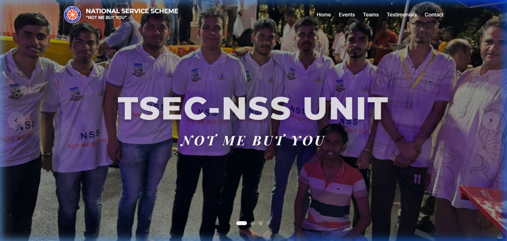
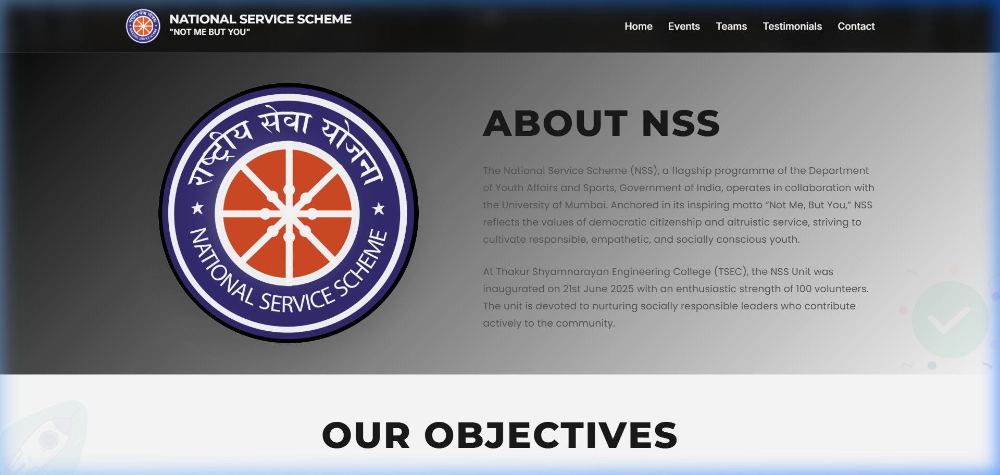
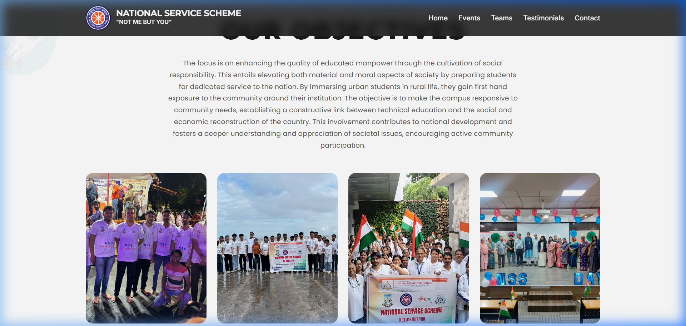
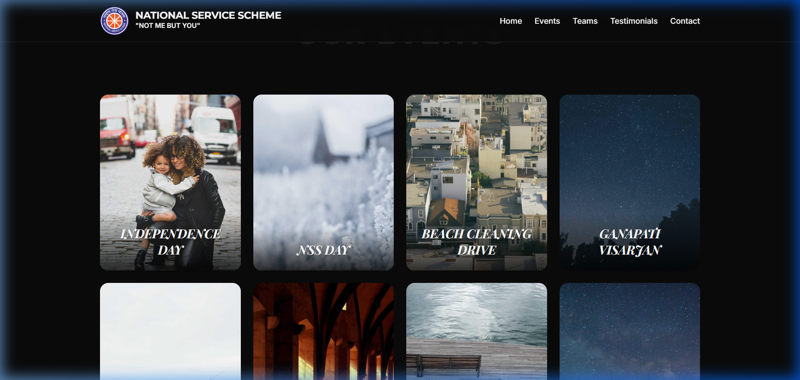
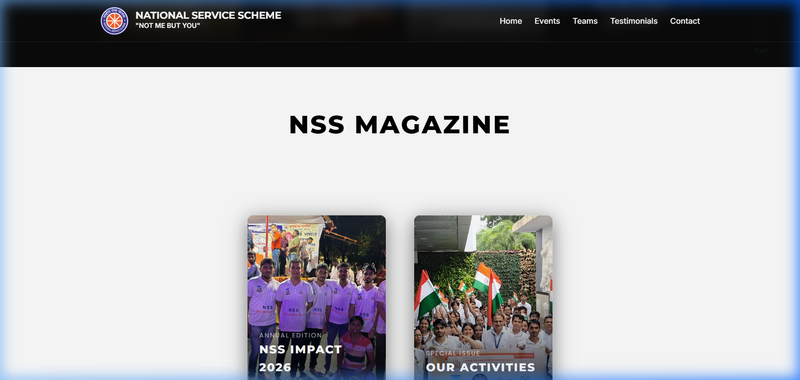
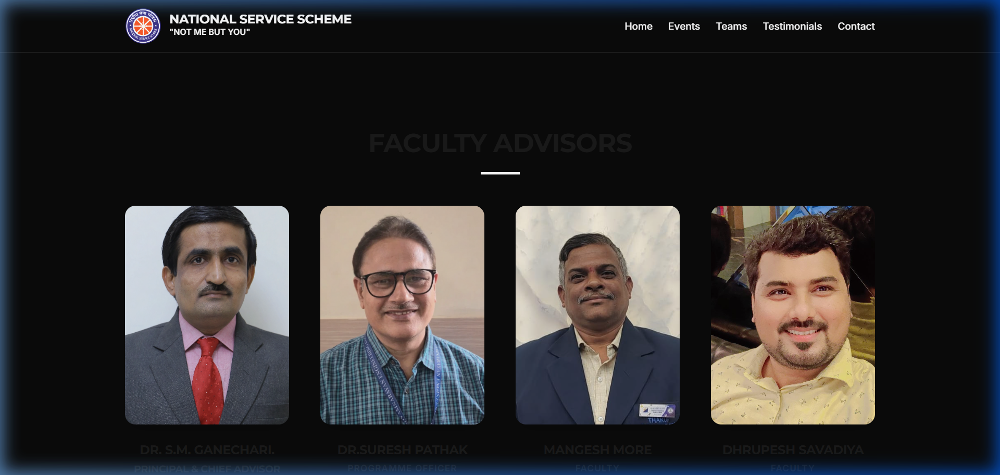
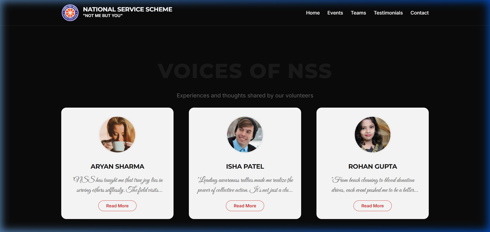

# NSS TSEC Mumbai - National Service Scheme

[](https://github.com/Bhavesh1411/NSS-website)

A premium, cinematic web platform for the **National Service Scheme (NSS)** unit of **Thakur Shyamnarayan Engineering College (TSEC)**. Built with modern web technologies to showcase the unit's events, impact, and social service initiatives.

## 🌟 Key Features

- **Cinematic Experience**: Smooth transitions and entry animations using GSAP and ScrollTrigger.
- **Interactive 3D Magazine**: A custom-built, interactive CSS/JS magazine viewer showcasing past activities.
- **Dynamic Event Timeline**: Visual journey through NSS TSEC's flagship events.
- **Responsive Design**: Fully optimized for all screen sizes.
- **Lottie Animations**: High-quality vector animations for an engaging UI.
- **Content Management Admin**: A private web page for authorized team members to add/update events, teams, testimonials, magazine pages, objectives, hero text, and contact info — **without touching code** and **without a database**.

---

## ✏️ Content Management (Admin)

The website content is **no longer hardcoded** — it lives in editable files and can be changed through a **web-based admin page**.

- **How it works (simple):** An editor opens the admin page, signs in with GitHub, fills in simple forms (add an event, upload a photo, edit a testimonial), and clicks **Save**. The change is stored, the website rebuilds automatically (via Vercel), and visitors see the update in about a minute. Every save is recorded, so the owner can **undo/revert** any change.
- **Who can edit:** Only people invited as **repo contributors** (via GitHub). Visitors just see the website.
- **No database, no server to manage:** Content is stored as simple JSON files in the repository and served by the same static host. No MySQL/Postgres/MongoDB involved.
- **Live site:** `https://nss-website-pink.vercel.app/`

**Guides:**
- 👤 **For editors (non-technical):** see `docs/ADMIN_GUIDE.md` — how to log in and edit every section.
- 🔧 **For the tech lead / setup:** see `docs/ADMIN_SETUP.md` — how to configure the admin and OAuth.
- 📐 **Data schema reference:** see `docs/DATA_SCHEMA.md` and the full design in `docs/CMS_SOLUTION_REPORT.md`.

---

## 📸 Visual Walkthrough

### 🏠 Hero Section
Welcome to the TSEC-NSS Unit. "Not Me, But You."


### ℹ️ About NSS
Learn about the mission and history of the National Service Scheme at TSEC.


### 🎯 Our Objectives
Interactive cards highlighting the core pillars of our community engagement.


### 📅 Our Events
A curated gallery of our most impactful events, from Independence Day to Hackspark.


### 📖 NSS Magazine
Explore our "NSS Impact" annual edition in a stunning, interactive viewer.


### 👥 Our Teams
Meet the dedicated volunteers and leaders driving our mission.


### 💬 Testimonials
Real stories and voices from the NSS TSEC community.


---

## 🛠️ Technologies Used

- **HTML5 & CSS3**: Semantic structure and custom styling.
- **JavaScript (Vanilla)**: Core logic and interactivity.
- **GSAP (GreenSock Animation Platform)**: Cinematic scroll-triggered animations.
- **ScrollTrigger**: Advanced scroll-based interactions.
- **Lottie**: Lightweight vector animations.
- **Google Fonts**: Inter & Montserrat for premium typography.

---

## 🚀 Getting Started

### Prerequisites
- A modern web browser (Chrome, Firefox, Safari).

### Local Setup
1. Clone the repository:
   ```bash
   git clone https://github.com/Bhavesh1411/NSS-website.git
   ```
2. Open `index.html` in your browser.
3. (Optional) Run a local server for the best experience:
   ```bash
   python -m http.server 8000
   ```
   Then visit `http://localhost:8000`.

---

## 🤝 Join Us
"Not Me, But You." Join us in serving society and building a better nation.

**Developed with ❤️ for NSS TSEC Mumbai**
