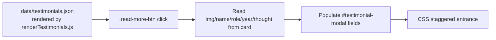

# Architecture — NSS TSEC Mumbai Website

This document explains the overall architecture of the static website: how pages relate to shared and page-specific assets, how features are wired, and how data flows from JavaScript into the DOM.

---

## 1. Architectural Model

The project is a **traditional multi-page application (MPA)**. There is **no SPA router, no framework, no bundler, and no build step**. Each of the four pages is a standalone, complete HTML document that independently loads the shared stylesheet plus its own feature modules.

| Page | File | Purpose | Own feature scripts |
| --- | --- | --- | --- |
| Home | `index.html` | Landing page: hero, about, objectives, events, magazine, footer | `data.js`, `renderHome.js`, `script.js`, `intro.js`, `preloader.js`, `magazine.js`, `events-calendar.js` |
| Events | `events.html` | Full activity timeline + filters + table + lightbox | `data.js`, `script.js`, `preloader.js`, `events-timeline.js` |
| Teams | `teams.html` | Faculty, leadership, council, committee | `data.js`, `renderTeams.js`, `script.js`, `preloader.js` |
| Testimonials | `testimonials.html` | Volunteer cards + modal | `data.js`, `renderTestimonials.js`, `preloader.js`, `testimonials.js` |

### Shared vs. page-specific assets

| Kind | Files | Used on |
| --- | --- | --- |
| Global design system | `style.css` | Every page |
| Global preloader/offline | `preloader.js` + `preloader.css` | Every page |
| Global animation logic | `script.js` | Home, Events, Teams (not Testimonials) |
| Hero slider | `hero.css` (no JS file; logic in `script.js`) | Home only |
| Intro | `intro.js` + `intro.css` | Home only |
| Magazine | `magazine.js` + `magazine.css` | Home only |
| Events calendar | `events-calendar.js` + `events-calendar.css` | Home only |
| Events timeline | `events-timeline.js` + `events-timeline.css` | Events only |
| Testimonials | `testimonials.js` + `testimonials.css` | Testimonials only |

---

## 2. Page Assembly Diagram

```mermaid
graph TB
    subgraph index.html
        I_HEAD[<head> meta + Google Fonts]
        I_CSS[style.css, hero.css, preloader.css, intro.css, magazine.css, events-calendar.css]
        I_JS_BODY[intro.js, preloader.js (in <body>)]
        I_CDN[Lottie player CDN]
        I_SECTIONS[hero / who-we-are / objectives / events / magazine / footer]
        I_JS_END[GSAP CDN + script.js + magazine.js + events-calendar.js]
    end

    subgraph events.html
        E_CSS[style.css, events-timeline.css, preloader.css]
        E_JS[preloader.js, script.js, events-timeline.js]
        E_SECTIONS[timeline-hero, year tabs, filter bar, timeline, all-events table, lightbox]
    end

    subgraph teams.html
        T_CSS[style.css, preloader.css]
        T_JS[preloader.js, GSAP CDN, script.js]
        T_SECTIONS[faculty, five-frame, leadership, council marquee, committee table]
    end

    subgraph testimonials.html
        M_CSS[style.css, testimonials.css, preloader.css]
        M_JS[preloader.js, GSAP CDN, testimonials.js]
        M_SECTIONS[hero, cards grid, modal, footer]
    end
```

---

## 3. Component Breakdown

### 3.1 Global script — `script.js`
Wraps everything in one `DOMContentLoaded` handler (`script.js:6`) and runs on any page that includes it. Key strategies:

- **Conditional execution by DOM presence** — each animation block first checks `document.querySelector('#some-section')` so the same file works on multiple pages without errors.
- **Conditional execution by URL** — navbar forcing for `teams.html` (`script.js:32`) and hero/teams slideshow guards.
- **GSAP plugin registration** once at the top (`script.js:8`): `ScrollTrigger`, `ScrollToPlugin`.

Responsibilities: hero title/quote reveal, navbar scroll state, hero slider, smooth-scroll for hash links, letter-splitting section titles, section entrance timelines, footer entrance, council marquee, divider reveal.

### 3.2 Homepage feature modules
- **Intro** (`intro.js`): builds an overlay, guards with `sessionStorage` key `nss_tsec_intro_v1`, animates a logo roll-in, typewriter text (read from `data/site.json` → `introText.line1`/`line2`, e.g. "TSEC NSS UNIT" / "MH09SB39"), then exits with a curtain-slide-up and removes itself.
- **Hero** (`hero.css` + `script.js:52`): cross-fading slides, dynamic dots, autoplay, hover-pause.
- **Magazine** (`magazine.js`): builds the full 3D book DOM at runtime; see `docs/MAGAZINE_VIEWER.md`.
- **Events calendar** (`events-calendar.js`): renders the hidden archive calendar tab; see `docs/EVENT_SYSTEM.md`.

### 3.3 Events page — `events.html` + `events-timeline.js`
The most data-heavy page. `events-timeline.js` loads its data from `data/events/<year>/*.json`
(via the shared `data.js` loader) and renders three things from it: the **month-grouped
timeline**, the **category filter chips**, and the **All Events table**. See `docs/EVENT_SYSTEM.md`.

### 3.4 Teams page — `teams.html` + `renderTeams.js`
`renderTeams.js` renders the faculty, leadership, council (marquee), and committee table from
`data/team-members.json`; `script.js` animates the team cards on load and powers the infinite
marquee slideshow by cloning the track and translating it with GSAP (`script.js:326`). See
`docs/TEAMS_AND_TESTIMONIALS.md`.

### 3.5 Testimonials page — `testimonials.html` + `renderTestimonials.js`
Cards are rendered from `data/testimonials.json` by `renderTestimonials.js`; `testimonials.js`
adds GSAP entrance animations and a modal that copies data from the clicked card. See
`docs/TEAMS_AND_TESTIMONIALS.md`.

---

## 4. Data Flow

All dynamic content originates from **JSON files in `data/`** — the single source of truth —
fetched at runtime by the shared loader `data.js` (which exposes `window.NSS.getData()` /
`getEvents(year)` and an offline fallback snapshot). The renderers
(`renderHome.js`, `renderTeams.js`, `renderTestimonials.js`, `events-timeline.js`,
`events-calendar.js`, `magazine.js`, `intro.js`) read from that loader and inject into the DOM.
There are **no hardcoded content arrays** in the JS. The only external network calls are CDN
asset URLs (Lottie JSON, fonts, GSAP, placeholder images).

### 4.1 Events data flow (events page)

```mermaid
flowchart LR
    DATA[data/events/&lt;year&gt;/*.json<br/>loaded by data.js getEvents()]
    GRP[groupByMonth()<br/>events-timeline.js:67]
    BUILD[buildMonthBlock() + buildCardHTML()<br/>events-timeline.js:82,102]
    DOM[(DOM:<br/>#timeline, #filter-chips,<br/>#events-table-body)]
    FILT[applyFilters()<br/>events-timeline.js:250]
    UI[User: chips / search / year tabs / node clicks]
    DATA --> GRP --> BUILD --> DOM
    UI --> FILT --> DOM
    DOM -->|event delegation| LIGHTBOX[Lightbox<br/>events-timeline.js:403]
```

**Step-by-step:**
1. On `DOMContentLoaded`, `loadEventsData()` fetches both years via `window.NSS.getEvents()`,
   then `renderAcademicYear(NSS_EVENTS)` runs with the 2025-26 dataset (`events-timeline.js:311-317`).
2. Events are grouped into a `Map<"Month YYYY", events[]>` (`groupByMonth`, `events-timeline.js:67`).
3. HTML for each month block (heading, horizontal strip of nodes, and a featured card) is generated as a string and injected into `#timeline .container` via `innerHTML` (`events-timeline.js:152`).
4. Unique tags produce the filter chips; the events table is rebuilt and sorted by date; rows beyond the 5th are hidden behind the "View Complete List" toggle.
5. Filters/search re-render visibility (`applyFilters`), and node/card/table clicks open a lightbox with the event photo.

### 4.2 Calendar data flow (homepage archive)
```mermaid
flowchart LR
    EV[data/events/2025-26/*.json<br/>loaded via getEvents('2025-26')<br/>events-calendar.js:60-66]
    PARSE[parseEventDate()<br/>events-calendar.js:371]
    CELL[Build .calendar-day-cell<br/>events-calendar.js:218]
    CLICK[Click day → selectDayCell]
    DETAIL[renderEventDetails()<br/>events-calendar.js:266]
    LB[openHomeLightbox()<br/>events-calendar.js:326]
    EV --> PARSE --> CELL --> CLICK --> DETAIL --> LB
```
The widget is bounded to `START_DATE` (2025-07-01) and `END_DATE` (2026-02-28), with prev/next nav disabled at the edges.

### 4.3 Magazine data flow
```mermaid
flowchart LR
    PAGES[data/magazine.json<br/>loaded via getData()<br/>magazine.js:23-34]
    BUILDV[buildViewer()<br/>magazine.js:48]
    OPEN[Open via .magazine-card click]
    FLIP[flipForward / flipBackward / drag / keys]
    STATE[state-closed / state-open / state-back]
    PAGES --> BUILDV --> OPEN --> FLIP --> STATE
```
The viewer is built once (lazily) from `data/magazine.json` (cover, foreword, pages) and reused.
`getTotalFlippable()` derives the flip count from the loaded pages (`magazine.js:43`). See
`docs/MAGAZINE_VIEWER.md`.

### 4.4 Testimonials data flow

No data array — cards are rendered from `data/testimonials.json`, and the modal reads the values
straight from the clicked card's DOM (`testimonials.js:54-58`).

---

## 5. Rendering Strategy Summary

| Page/content | Strategy |
| --- | --- |
| Structural layout, sections, nav, footer | Static HTML shell + shared `data.js` footer render |
| Hero slider, objectives, about, events grid, footer | **JS-generated DOM** (rendered from `data/` by `renderHome.js`) |
| Teams (faculty/leadership/council/committee) | **JS-generated DOM** (from `data/team-members.json`) |
| Testimonials cards | **JS-generated DOM** (from `data/testimonials.json`) |
| Events timeline, filters, table, chips | **JS-generated DOM** (innerHTML/template strings from `data/events/<year>`) |
| Events calendar | **JS-generated DOM** |
| Magazine viewer | **JS-generated DOM** (entire overlay built at runtime from `data/magazine.json`) |
| Testimonials modal | Static modal shell, populated on click |

---

## 6. Dependency / Load Order Notes

- On the homepage, Lottie is loaded **in `<head>`** (`index.html:26`), while GSAP is loaded **at the end of `<body>`** (`index.html:501`). `script.js` and the feature scripts come after GSAP.
- On Teams/Testimonials pages, GSAP is loaded at the bottom too; on the Events page, GSAP is **not loaded at all** (no dependency there — timeline uses CSS transitions and vanilla JS).
- `script.js` is loaded **before** `events-timeline.js` on the events page, and before `magazine.js`/`events-calendar.js` on the homepage.

See [docs/TECH_STACK.md](docs/TECH_STACK.md) for line-level evidence of every dependency.
