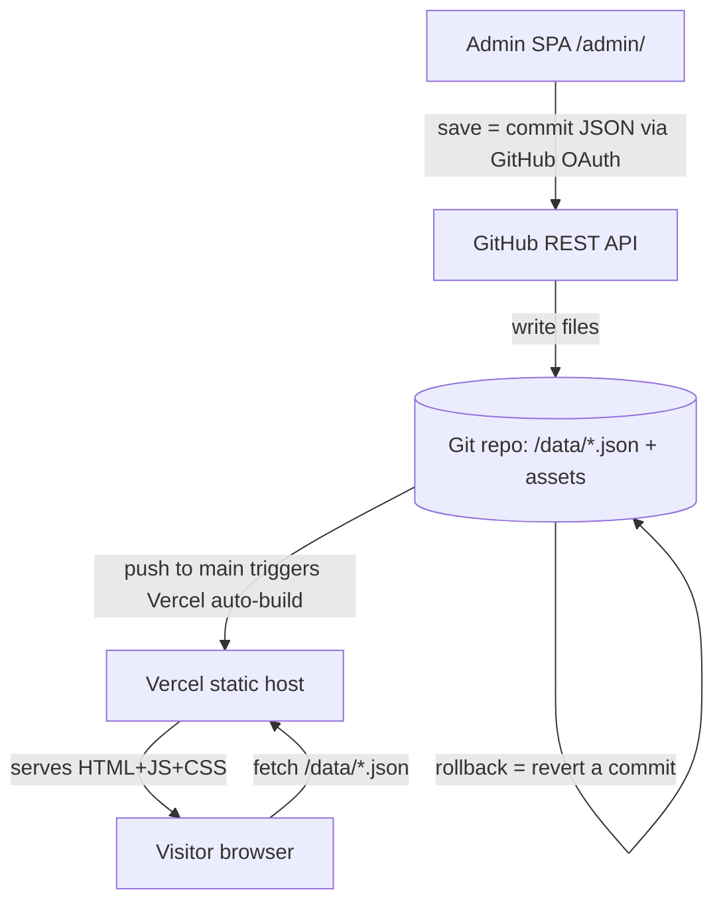

# Making the NSS Website Dynamic — A No-Database CMS Solution Report

**Author:** opencode (acting as senior software architect)
**Date:** 2026-10-01
**Scope:** Research, evaluation, decision, and full solution design for adding a web-based admin page to edit website content **without a traditional database**.
**Status:** Design only — no source code modified. Awaiting approval before implementation.

---

## 0. Executive Summary

The NSS TSEC website is a **100% static, multi-page site** (4 HTML pages, 7 JS files, 8 CSS files) with **no build step, no package manager, and no git repo initialized locally**. All content is hardcoded in three ways: (a) inline HTML in `.html` files, (b) JS arrays inside `.js` files, and (c) repeated/duplicated datasets across files. The site is designed to deploy to **GitHub Pages, Netlify, Vercel, or Cloudflare Pages** with zero build command.

The site owner wants a **browser-based admin** so non-developers can add/update events, teams, testimonials, magazine pages, objectives, hero text, and contact info — with changes reflected on the live site — **without a traditional database**.

**Recommendation:** Adopt a **Git-based CMS** — **Sveltia CMS** (or **Decap CMS**, formerly Netlify CMS) — storing all content as **flat JSON files in the Git repository**, committing changes through the **GitHub API**. Content is versioned by Git (rollback = revert a commit), authenticated via GitHub OAuth, and requires **no server, no database, and no cost**. The existing static site is refactored to **fetch the flat-file content** (served by the same static host) and render it client-side, exactly as the current JS already does.

**Why a Git CMS over a custom-built admin:** The site already has *zero build tooling*. A fully hand-rolled admin (custom GitHub-API UI) would mean building authentication, token storage, file parsing, form validation, image upload, and preview from scratch — a large, security-sensitive surface. A Git CMS provides all of this out of the box (forms, drag-and-drop media, rich-text widgets, previews) for free, and its content model is defined declaratively in a single config file. It fits the "no server / no DB / free / static hosting" constraints perfectly and is the lowest-risk, lowest-maintenance path for a small team of non-technical editors.

---

## 1. Current Project Analysis (Step 1)

### 1.1 Tech stack (verified from source)

| Layer | Technology | Evidence |
|---|---|---|
| Markup | HTML5 (MPA, no SPA) | `index.html`, `events.html`, `teams.html`, `testimonials.html` |
| Styling | CSS3, design-system variables | `style.css`, `hero.css`, `intro.css`, `preloader.css`, `magazine.css`, `events-calendar.css`, `events-timeline.css`, `testimonials.css` |
| Language | Vanilla JS (ES6+, IIFEs) | `script.js`, `intro.js`, `preloader.js`, `events-timeline.js`, `events-calendar.js`, `magazine.js`, `testimonials.js` |
| Animation | GSAP 3.12.2 + ScrollTrigger + Lottie | CDN-loaded |
| Data | **Hardcoded JS arrays + hardcoded HTML** | — |
| Build | **None** (no `package.json`, no bundler) | — |
| Hosting | Static (GitHub Pages / Netlify / Vercel / CF Pages) | `docs/DEPLOYMENT.md` |

Key fact: there is **no local `.git` directory** in `D:\NSS\website`, but the README references a GitHub repo `Bhavesh1411/NSS-Website`. A sibling folder `D:\NSS\Records\nss_system` contains a **separate PHP attendance system** — it is NOT part of the website and is out of scope for this task.

### 1.2 Where content lives today (the "hardcoded inventory")

| # | Content type | Current storage | Location | Editable fields |
|---|---|---|---|---|
| 1 | **Hero text** (title + quote) | Inline HTML | `index.html:62-63` | `TSEC-NSS UNIT`, `NOT ME BUT YOU` |
| 2 | **Hero slider images** | Inline HTML (5 `.slide` blocks) | `index.html:66-90` | image paths, count |
| 3 | **About / "Who We Are"** | Inline HTML | `index.html:118-122` | heading, 2 paragraphs |
| 4 | **Objectives** (intro + 4 cards) | Inline HTML | `index.html:141-187` | intro text; per-card image, title, description |
| 5 | **Home "Our Events" grid** | Inline HTML (12 `.event-card`) | `index.html:219-339` | image, title |
| 6 | **Events timeline (2025-26)** | JS array `NSS_EVENTS` | `events-timeline.js:28` | date, title, tag, photo |
| 7 | **Events timeline (2026-27)** | JS array `NSS_EVENTS_2026_27` | `events-timeline.js:84` | date, title, tag, venue, photo |
| 8 | **Events calendar (archive)** | JS array `EVENTS_2025_26` | `events-calendar.js:30` | **duplicate of #6** |
| 9 | **Category to icon map** | JS object `CATEGORY_ICON` | `events-timeline.js:7`, `events-calendar.js:9` | tag to emoji |
| 10 | **Magazine content** | JS array `pagesData` (+ cover hardcoded) | `magazine.js:10`, `magazine.js:54` | per-page img, title, desc; foreword; cover |
| 11 | **Teams: faculty advisors** | Inline HTML (3 cards) | `teams.html:60-105` | photo, name, role, hover quote |
| 12 | **Teams: faculty (5-frame)** | Inline HTML (5 cards) | `teams.html:110-186` | photo, name, role |
| 13 | **Teams: leadership** | Inline HTML (5 cards) | `teams.html:199-281` | photo, name, role, hover word |
| 14 | **Teams: council (marquee)** | Inline HTML (15 cards) | `teams.html:290-534` | photo, name, role |
| 15 | **Teams: core committee table** | Inline HTML table | `teams.html:549-648` | name, designation (partially duplicates #13/#14) |
| 16 | **Testimonials** | Inline HTML (7 cards) | `testimonials.html:62-172` | avatar, role, year, name, thought |
| 17 | **Footer / contact** | Inline HTML (all 4 pages) | `index.html:434-496` etc. | TSEC link, email, 4 phone/name lines, map iframe, copyright |
| 18 | **Intro text** (typewriter) | Hardcoded strings | `intro.js:108,113` | "TSEC NSS UNIT", "MH09SB39" |

### 1.3 Key architectural observations

1. **Data is duplicated in multiple places.** The 2025-26 events exist in BOTH `events-timeline.js` (`NSS_EVENTS`) and `events-calendar.js` (`EVENTS_2025_26`), and a subset is hardcoded again in `index.html`. This is the single biggest maintenance risk and the primary reason content is painful to update today.
2. **Two content-rendering patterns exist:**
   - **JS-generated DOM** (events timeline, calendar, magazine) — data arrays to template strings to `innerHTML`.
   - **Static HTML** (teams, testimonials, hero, objectives, about, footer) — no JS rendering; the testimonials *modal* reads values directly from the clicked card's DOM.
3. **No fetch/API calls exist** — everything is inline. This makes the site trivially portable to any static host.
4. **The hidden `#magazine` section and the calendar tab** are `display:none` but must not be deleted; the owner likely wants to re-enable them later, so their content should be managed too.

### 1.4 Hosting (confirmed)

The site is deployed on **Vercel** at `https://nss-website-pink.vercel.app/` (confirmed by the owner). The site is not currently a git repo locally, and there is no `netlify.toml` / `vercel.json` / `.github` in the folder. For a Git-based CMS to work, the site must live in a GitHub repo that the Vercel project auto-builds from on push. This is the deployment assumption for the rest of the design.

---

## 2. Requirements & Constraints (Step 2)

### 2.1 Hard constraints

- **No traditional database** (no MySQL / Postgres / MongoDB / any SQL or NoSQL DB server).
- **No server to maintain** — must work with static hosting, or at most *minimal/serverless* that we do not operate.
- **Must work on static hosting** (GitHub Pages / Netlify / Vercel / Cloudflare Pages) with no (or trivial) build step.
- **Free or very low cost** — a student/society-run site.
- **Secure** — only authorized editors can change content; no exposed admin that anyone can edit; no leaking credentials.

### 2.2 Soft constraints (desirable)

- **Ease of use for non-technical editors** — forms, not code.
- **Version history / rollback** — undo a bad edit.
- **Ability to add images** — drag-and-drop uploads.
- **Preview before publish** — see changes before they go live.
- **Mobile-friendly admin** — editors will use phones.
- **Minimal changes to existing design** — do not rewrite the site; keep the look and animations.

### 2.3 User roles

- **1-2 admins** (tech lead / site owner): full control, manage other editors, approve/revert.
- **A few core team members** (council heads — PR, events, media): edit their sections.
- **Public visitors**: read-only; never see the admin.

### 2.4 Content types requiring CRUD

Each of these is an entity with Create/Read/Update/Delete:

1. **SiteConfig** (hero title/quote, about text, objectives intro, contact info, social links, intro strings)
2. **HeroSlide** (image, optional caption, order)
3. **Objective** (image, title, description, order)
4. **Event** (date, title, category/tag, venue, photo, academic-year, order)
5. **CategoryIcon** (tag to emoji mapping)
6. **MagazinePage** (front/back image, title, description, order) plus magazine cover/foreword
7. **TeamMember** (name, role, section [faculty/leadership/council/committee], photo, hover quote, order)
8. **Testimonial** (name, role, year, thought, avatar, order)

That is **8 entity types**, all needing the admin to CRUD them, with the renderer consuming the same data.

---

## 3. Research & Evaluation of Approaches (Step 3)

I evaluated seven categories against the constraints.

### 3.1 Approach 1 — Git-based CMS (Decap / Sveltia / Tina / Prose / CloudCannon)

**How it works:** A small admin SPA (e.g. `/admin/`) is served by the static host. The editor logs in via GitHub OAuth. On save, the CMS writes a **YAML/JSON/Markdown file** into the repo and creates a **git commit** via the GitHub API. A deploy hook rebuilds/redeploys the static site. Content lives in the repo as plain files.

- **Decap CMS:** Open source (MIT), free, no server needed for the admin itself. Git Gateway or direct GitHub backend. Editorial workflow, previews, media library, most mature. The GitHub backend for Decap needs either Git Gateway (Netlify Identity) or a small serverless OAuth function to obtain a GitHub token — the one moving part.
- **Sveltia CMS:** Drop-in Decap-compatible alternative that uses GitHub's **fine-grained OAuth entirely client-side**, so it runs on **pure static hosting (e.g. Vercel) with no serverless function**. Increasingly popular and the reason I rank it first.
- **TinaCMS:** Git-backed but optimized for Next.js/React; overkill for a no-build vanilla site.
- **Prose:** Minimal open-source markdown editor for GitHub; no structured forms/validation.
- **CloudCannon:** Commercial (paid) — violates "free/low cost" and requires their platform.

**Strengths:** no DB, no persistent server, free, native version control, built-in auth, drag-and-drop images, previews, mobile-responsive admin, structured forms with validation, works with any static host that can run an OAuth callback. Content is portable and human-readable.
**Weaknesses:** requires converting the site to **read from files instead of inline data** (refactor); the GitHub OAuth token flow is the fiddliest part; deployment is triggered per-save (small delay before live). For Decap you typically need Netlify Identity + Git Gateway or a tiny OAuth serverless function; **Sveltia avoids this**.

### 3.2 Approach 2 — Custom admin UI calling the GitHub (or GitLab) API directly

Build our own `admin.html` that uses the GitHub Contents API (and a PAT or OAuth token) to read/commit JSON files.

**Strengths:** full control; no dependency on a third-party CMS; works on pure static hosting.
**Weaknesses:** we must build, from scratch: OAuth flow + secure token storage (a PAT cannot be safely stored in a static front end; a serverless function is needed for OAuth), JSON schema validation, a form system for 8 entities, image upload (base64 into the repo), diff/preview, and error handling. This is **many weeks of work and a large security surface** (token handling, commit authoring, path traversal). Given there is no existing build system or backend, this is the **highest-effort** option. Only justified if the team wants zero third-party dependency and accepts owning all the maintenance.

### 3.3 Approach 3 — External JSON storage services (JSONBin, Firebase RTDB free tier, Supabase)

These are **databases or database-like backends** accessed via API from the browser.

**Strengths:** instant realtime updates (no deploy), easy reads/writes.
**Weaknesses:** **directly violates the "no DB" hard constraint** (Firebase RTDB and Supabase are real databases; JSONBin is a hosted key-value store); introduces a dependency on a third-party service with availability/cost risk; requires **API keys baked into the front end** (hard to keep secret on a static site); often rate-limits the free tier; and **loses version control** unless built. Not recommended given the explicit constraint.

### 3.4 Approach 4 — Serverless functions writing JSON to a repo or object storage

e.g. Netlify Functions / Vercel Edge / Cloudflare Workers that receive admin POSTs and write JSON to a bucket (S3/R2) or commit to a repo.

**Strengths:** centralizes write logic; could give near-realtime updates.
**Weaknesses:** **introduces a serverless backend to build, host, and maintain** (contradicts "no server to maintain" and adds cost/ops); still needs auth; the site then reads from a non-static source, which can hurt static-host performance and SEO; object storage costs money at scale. **Overkill** for this project's scale and editor count.

### 3.5 Approach 5 — Headless CMS with a free tier (Strapi Cloud, Sanity, Contentful)

**Strengths:** polished editing, structured schemas, image CDN, realtime previews.
**Weaknesses:** the **underlying infrastructure is a hosted database/backend** — a managed database service, so it does not truly satisfy "no DB" (the DB is outsourced, not eliminated). Free tiers are limited (Sanity free tier is generous but still DB-backed SaaS; Contentful free is very limited; Strapi Cloud free is constrained). Adds another service to depend on, an account to manage, and usually higher long-term cost. Does not align with "must be free / no DB."

### 3.6 Approach 6 — Google Sheets / Airtable as a backend

Publish a sheet; the site fetches it (via the Sheets API or Airtable API).

**Strengths:** editors already know spreadsheets; near-zero setup for the "backend."
**Weaknesses:** **not a database but a fragile stand-in**: API rate limits, CORS issues, inconsistent types, no image storage (images must be hosted elsewhere), weak auth/row-level permissions, no real per-record version control, and the site becomes dependent on a third-party API with its own uptime/quoting. Fits only a quick prototype or a small, low-stakes dataset; poor for a permanent public site with images and multiple editors.

### 3.7 Approach 7 — Creative alternatives

- **GitHub Issues as content:** store each event/testimonial as an Issue and render via the Issues API. Free and Git-versioned, but the editor UX (issues/tags/markdown) is poor for structured content, and rate limits + rendering complexity make it a bad fit.
- **Static regeneration on every save (SSG):** introduce a real SSG (Hugo/Eleventy/Astro) that rebuilds the site from content files at deploy time. This is actually the **cleanest long-term architecture** and pairs naturally with a Git CMS (the CMS writes content files; the SSG renders HTML at build). The current site has **no build step**, so adding an SSG is a larger change — but it yields fully server-rendered pages (best SEO, no client fetch, no flash of unstyled content). Worth mentioning as the "ideal end-state" variant of Approach 1.
- **Content-as-data with no SSG:** keep the static HTML shells and have the JS `fetch()` content JSON files at runtime (client-side rendering). Less build change than an SSG, keeps all existing animations, but adds a brief load/fetch and needs a fallback.

### 3.8 Comparison table

Scoring: Good / Acceptable / Poor. "Server" = persistent server to operate. "DB" = traditional database. "Free" = no ongoing cost at this scale.

| Approach | Needs DB? | Needs server? | Free? | Setup effort | Editor ease | Security | Version control | Images | Preview | Scale | Static-host fit | Maintainability |
|---|---|---|---|---|---|---|---|---|---|---|---|---|
| 1. Git CMS (Decap) | No | No (GitHub OAuth; optional tiny serverless) | Yes | Medium | Good | Good | Yes (git) | Good | Good | Good | Good | Good |
| 1b. Git CMS (Sveltia) | No | **No** (pure GitHub OAuth) | Yes | Medium | Good | Good | Yes | Good | Good | Good | Good (best on Pages) | Good |
| 1c. Git CMS + SSG | No | No | Yes | Medium+ (build) | Good | Good | Yes | Good | Good | Good | Good | Good (cleanest) |
| 2. Custom GitHub-API admin | No | No (OAuth needs serverless fn) | Yes | **High (weeks)** | Medium (we build) | Medium (we secure) | Yes | Medium | Medium | Good | Good | Poor (we maintain) |
| 3. JSONBin / Firebase / Supabase | **Yes** (violates) | No (SaaS) | Medium (rate-limited) | Medium | Good | Poor (keys in front end) | No | Medium | Medium | Medium | Medium | Poor |
| 4. Serverless functions to files/objects | No | **Yes** (build+maintain) | Medium | Medium+ | Medium | Medium | Medium | Medium | Medium | Medium | Medium | Poor |
| 5. Headless CMS (Sanity/Strapi/Contentful) | **Yes** (outsourced) | No (SaaS) | Medium (limited) | Medium | Good | Good | Medium | Good | Good | Good | Medium | Medium |
| 6. Google Sheets / Airtable | No (sheet) | No | Yes | Easy | Good | Poor | No | Poor | Poor | Poor | Poor | Poor |
| 7. GitHub Issues as content | No | No | Yes | Medium | Poor | Medium | Yes | Poor | Poor | Medium | Good | Medium |

---

## 4. Decision & Justification (Step 4)

### 4.1 Recommendation

**Approach 1 — Git-based CMS**, specifically **Sveltia CMS**, with content stored as **JSON files** and rendered **client-side** by the existing JS.

> **Confirmed with the owner:** Host = **Vercel** (`https://nss-website-pink.vercel.app/`); CMS = our choice (**Sveltia**); editors = **repo contributors only**; **publish immediately** (git history retained for rollback); **no SEO / SSG** needed. These decisions are reflected throughout.

### 4.2 Why

1. **Satisfies every hard constraint.** No DB (content = files), no persistent server (Sveltia uses GitHub OAuth entirely client-side; Decap needs only a tiny optional serverless OAuth function or Netlify Identity), works on pure static hosting, **$0 cost**, and auth is GitHub's battle-tested OAuth (editors must be invited as collaborators; only their tokens can write).
2. **Best "editor ease" for the cost.** Non-technical editors get structured forms, rich text, drag-and-drop image uploads, and previews — exactly what the soft constraints ask for — without us writing any admin UI.
3. **Native version control and rollback.** Every save is a git commit. Rolling back = `git revert` / `git checkout` of a commit. Strictly better than any hand-rolled or SaaS approach.
4. **Fits the project's "no build" reality.** The site already renders content via JS arrays. Converting those arrays to `fetch()`ed JSON files is a **mechanical, low-risk refactor** that preserves all existing GSAP/CSS behavior. No bundler or SSG is required to ship.
5. **Minimal new attack surface.** The only new component is the admin SPA + OAuth, maintained by an established open-source project rather than bespoke code.
6. **Long-term maintainability.** Content becomes human-readable, diffable, portable files. No lock-in: if the team ever outgrows it, the files remain and can be handed to an SSG or migrated to a headless CMS.

### 4.3 Trade-offs and mitigations

| Trade-off | Mitigation |
|---|---|
| Per-save deploy delay before content is live | Acceptable for this use case (edits are not "realtime chat"). Add a clear "Publishing..." note in the admin and set the deploy hook to auto-run on `main`. |
| GitHub OAuth setup is the fiddliest part | Choose **Sveltia CMS** (no serverless OAuth function needed) or set up Netlify Identity once. Document it step-by-step. |
| Client-side fetch adds a brief load and needs a fallback | Implement a graceful fallback: if JSON fails to load, show a cached/default snapshot or a friendly message (see Section 5.8). |
| Refactoring static HTML sections (hero/teams/testimonials) to be JS-rendered | This is the main implementation effort; do it section-by-section in phases so the site never breaks (see Section 6). |
| SEO with client-side rendering is slightly weaker than SSG | **Not a concern** — the owner confirmed SEO/SSG is not needed. Dropped entirely. |

### 4.4 Ranking of viable options

1. **Sveltia CMS (git files, client-side render)** — **CHOSEN.** Best fit for the confirmed scenario: pure client-side GitHub OAuth (no serverless function), works on Vercel, free, publish-immediately model, small contributor set.
2. **Decap CMS (git files, client-side render)** — the more-mature alternative; only needed if a Netlify Identity / small serverless OAuth is preferred. Not chosen (extra moving part not required here).
3. **Custom GitHub-API admin** — only if the team wants zero third-party dependencies and accepts owning all the security/maintenance work; not worth it at this scale.
4. **Headless CMS (Sanity/Strapi)** — would require accepting a managed DB-backed SaaS, which violates the stated "no DB" constraint; not chosen.
5. **Git CMS + SSG (Hugo/Astro)** — dropped; owner confirmed no SEO/SSG need.
6. **Serverless functions to files/objects; Sheets/Airtable; GitHub Issues** — all rejected as poorer fits for the reasons above.

### 4.5 When each alternative is preferable

- **Use custom admin (#3)** if the owner explicitly forbids any third-party CMS and the team has time to build/secure/maintain it.
- **Use a headless CMS (#4)** if real-time editing across many devices with rich media is worth accepting a managed DB-backed service and possible future cost.
- **Use Sheets/Airtable (#6)** only for a throwaway prototype, never for the permanent public site.
- **Use an SSG + git CMS (#5)** only if SEO or first-load performance ever becomes critical; the owner confirmed it is not needed now.

---

## 5. Full Solution Design (Step 5)

The design below targets **Sveltia CMS** on **Vercel** (the confirmed host), with content as JSON and client-side rendering. It is structured so **Decap CMS** can be swapped in with minimal changes (differences are called out).

### 5.1 Architecture

Text diagram:

```
Admin (browser)                          Public site (browser)
/admin/ (Sveltia SPA)                    index/events/teams/testimonials pages
forms + previews                         existing HTML + JS
      |  GitHub OAuth (browser)                   |  fetch() /data/*.json
      v                                           v
GitHub REST API  <--reads/commits-->  Git repo (source of truth, versioned)
(read/commit content)                   /data/*.json         <- the "database"
      |  push to main                   /assets/uploaded/*
      v
Vercel auto-build on push to main  (connected Git repo)
      |
      v
Vercel static host  serves *.html, *.js, /data/*.json, /admin/*
```

Mermaid:



### 5.2 Data schemas (JSON) for every content type

All content is stored as JSON in `data/`. Where a Git CMS wants one file per entry (easier diffs, one record per file), we use **folder collections** (one JSON file per item); for small single-value config we use a single file.

**data/site.json** (single file — SiteConfig)
```json
{
  "hero": { "title": "TSEC-NSS UNIT", "quote": "NOT ME BUT YOU" },
  "about": {
    "title": "ABOUT NSS",
    "paragraphs": [
      "The National Service Scheme (NSS), a flagship programme of the Department of Youth Affairs and Sports...",
      "At Thakur Shyamnarayan Engineering College (TSEC), the NSS Unit was inaugurated on 21st June 2025..."
    ]
  },
  "objectives": {
    "intro": "The focus is on enhancing the quality of educated manpower...",
    "title": "Our Objectives"
  },
  "contact": {
    "college": "TSEC",
    "address": "Mumbai, Kandivali East",
    "collegeUrl": "https://tsecmumbai.in/",
    "email": "nss@tsecmumbai.in",
    "phoneLines": [
      { "label": "Dr. Suresh Pathak (PO)", "phone": "9869525639" },
      { "label": "Bhavesh Chaudhary (Youth President)", "phone": "7756828367" },
      { "label": "Aditi Singh (Youth President)", "phone": "9082070174" },
      { "label": "Siddhant Bhandari (Tech Head)", "phone": "9260003000" }
    ],
    "mapEmbedUrl": "https://www.google.com/maps/embed?...",
    "mapLink": "https://maps.app.goo.gl/1cJSEkku6nCB3DFB7",
    "copyright": "2026 NSS TSEC Mumbai",
    "tagline": "Not Me, But You."
  },
  "introText": { "line1": "TSEC NSS UNIT", "line2": "MH09SB39" }
}
```

**data/hero-slides.json** (single file — array of HeroSlide)
```json
{
  "slides": [
    { "image": "assets/photos/hero_1.jpg", "alt": "Hero 1", "order": 1 },
    { "image": "assets/photos/hero_2.jpg", "alt": "Hero 2", "order": 2 }
  ]
}
```

**data/objectives.json** (single file — array of Objective)
```json
{
  "items": [
    { "image": "assets/photos/hero_1.jpg", "title": "Community Understanding", "description": "Develop awareness about real-world community challenges", "order": 1 }
  ]
}
```

**data/events/2025-26/*.json** and **data/events/2026-27/*.json** (folder collection — one file per Event, named by slug)
```json
{
  "title": "Beach Cleaning Gorai",
  "date": "27 Sep 2026",
  "tag": "Environment",
  "venue": "Gorai",
  "photo": "assets/Events/beach-cleaning.jpeg",
  "order": 1
}
```
The **calendar dataset** (`EVENTS_2025_26` in `events-calendar.js`) is REMOVED and replaced by reading the same 2025-26 folder — this eliminates the biggest duplication.

**data/category-icons.json** (single file — CategoryIcon map)
```json
{
  "icons": {
    "hackathon": "CODE",
    "health drive": "HEART",
    "cultural event": "MASK",
    "awareness": "MEGAPHONE",
    "seminar": "GRAD",
    "event series": "CALENDAR",
    "patriotic event": "FLAG",
    "sports": "MEDAL",
    "environment": "SEEDLING",
    "rally": "SPEAKER",
    "ceremony": "TROPHY",
    "celebration": "CONFETTI",
    "orientation": "TARGET"
  }
}
```
Note: emoji stored as actual emoji characters is fine in JSON; the table above uses named placeholders for readability.

**data/magazine.json** (single file — MagazinePage array + cover/foreword)
```json
{
  "cover": { "image": "assets/photos/hero_1.jpg", "logo": "assets/nss_logo.png", "title": "NSS MAGAZINE" },
  "foreword": "Welcome to the inaugural edition...",
  "pages": [
    {
      "front": { "image": "assets/photos/hero_2.jpg", "title": "Independence Day Rally", "description": "A grand rally..." },
      "back": { "image": "assets/photos/hero_4.jpg", "title": "Blood Donation Camp", "description": "In collaboration..." },
      "order": 1
    }
  ]
}
```

**data/team-members.json** (single file — array of TeamMember, grouped by section)
```json
{
  "sections": {
    "faculty": [
      { "name": "Dr. S.M. Ganechari.", "role": "Principal & Chief Advisor", "photo": "assets/photos/pricipal.png.png", "quote": "NSS shapes our students...", "order": 1 }
    ],
    "leadership": [
      { "name": "Bhavesh Chaudhary", "role": "Youth President", "photo": "...", "quote": "...", "order": 1 }
    ],
    "council": [
      { "name": "Devkar Susmita", "role": "PR & Team Lead", "photo": "...", "quote": "NSS TSEC", "order": 1 }
    ],
    "committee": [
      { "name": "Bhavesh Chaudhary", "designation": "NSS Leader" }
    ]
  }
}
```
The core-committee table is derived from `committee` (and can merge leadership/council names) so it is no longer hand-duplicated.

**data/testimonials.json** (single file — array of Testimonial)
```json
{
  "items": [
    { "name": "Tirtha Pawar", "role": "Volunteer", "year": "Batch 2025-26", "thought": "My one year journey...", "avatar": "assets/testimonials/tirtha.png", "order": 1 }
  ]
}
```

### 5.3 Folder structure for content files

```
D:\NSS\website\
├── admin\                     # Git CMS admin SPA (index.html + config)
├── data\                      # the content "database" (all JSON)
│   ├── site.json
│   ├── hero-slides.json
│   ├── objectives.json
│   ├── category-icons.json
│   ├── magazine.json
│   ├── team-members.json
│   ├── testimonials.json
│   └── events\
│       ├── 2025-26\           # one JSON per event
│       └── 2026-27\           # one JSON per event
├── assets\
│   ├── ...                    # existing assets
│   └── uploaded\              # NEW: images uploaded via the CMS land here
├── index.html / events.html / teams.html / testimonials.html
├── *.js / *.css               # existing files (refactored to fetch() data)
└── vercel.json               # NEW: static framework preset (no build) for Vercel
```

### 5.4 Admin UI design

**Screens (Sveltia/Decap provide these out of the box; we only configure the collections and widgets in `config.yml`/`config.json`):**

1. **Login screen** — GitHub OAuth "Sign in with GitHub"; only invited collaborators can proceed.
2. **Dashboard / Collections list** — one entry per content type: Site Config, Hero Slides, Objectives, Events (subdivided by academic year), Category Icons, Magazine, Team Members, Testimonials.
3. **List view** — table/grid of entries with search, sort by order, and an "Add new" button.
4. **Editor view** — a form with fields and widgets:
   - **Text / textarea** for titles, quotes, thoughts (rich-text widget for paragraphs).
   - **Image widget** for photo/avatar/hero — with drag-and-drop upload to `assets/uploaded/`.
   - **Select widget** for category/tag and for team section (faculty/leadership/council/committee).
   - **Date widget** for event dates.
   - **Number widget** for order.
   - **List widget** for repeatable sub-blocks (phone lines, objectives, magazine pages, testimonial list).
5. **Preview pane** — a live preview of the public page as the editor types (via a preview template that renders the same HTML/CSS as the site).
6. **Workflow**: **Save = publish to `main` immediately** (confirmed by owner). Git history retains every prior version for rollback, so there is no need for a separate draft branch.

**Validation rules** (configured per field): required title/name/date, date format `DD Mon YYYY`, image must be an allowed type (jpg/jpeg/png/webp), order must be a positive integer, email format on the contact email.

### 5.5 Authentication & authorization flow

- The Git CMS uses **GitHub OAuth**. The editor clicks "Login" and authorizes the GitHub OAuth App.
- **Authorization is inherited from the repo's collaborator list.** Anyone with **write access** to the repo can edit content. Editors are added by the repo owner as **collaborators** (or via a GitHub team). This is the simplest secure model: no separate user store, permissions = repo permissions. **Confirmed by owner: editors = repo contributors only.**
- **Role granularity:** For 1-2 admins + a few editors, repo-write access is enough. If finer control is ever needed, use a GitHub team per role and protect the `data/` branch. For this project, keep it simple.
- **Token security:** With Sveltia, the OAuth token lives in the browser session only and is never stored on a server. No credentials are ever embedded in the static site.

### 5.6 How changes get published to the live site (build/deploy pipeline)

1. Editor saves in the admin → CMS commits JSON file(s) to `main` via the GitHub API (**publish immediately**, as confirmed).
2. **Vercel auto-build** fires on push to `main` (the repo is already connected to Vercel). Because the site is static and reads JSON at runtime, the "build" is just re-serving the same files — no compile step. Add a minimal `vercel.json` with the static framework preset to be explicit.
3. The live site's JS fetches `data/*.json` from the same static origin and re-renders. Visitors see the new content after the (typically <1 minute) deploy completes.
4. **Rollback:** the owner reverts the offending commit in GitHub (or via `git revert`), which triggers a fresh Vercel deploy. **Git version control is the backup history** — confirmed by owner.

### 5.7 Image / upload handling

- Editors use the CMS **media library** (drag-and-drop). Files are uploaded to `assets/uploaded/` and committed to the repo (via the same GitHub API commit), so images are versioned too and served from the static CDN — no external image host, no cost, no broken third-party dependency.
- Allowed types: `jpg`, `jpeg`, `png`, `webp`, `gif`. Size limit set in CMS config (e.g. 5 MB) to avoid bloating the repo.
- **Important note from the existing repo:** some images are huge (hero_3.png is 11.6 MB). We recommend the media library auto-compress, or instruct editors to upload web-optimized images. This is a quality-of-life improvement, not a blocker.

### 5.8 Migration plan: move existing hardcoded content into the new format

Do this once, as a scripted + manual pass, in the phases of Section 6:

1. **Events:** Extract `NSS_EVENTS`, `NSS_EVENTS_2026_27`, `EVENTS_2025_26`, and the homepage grid into `data/events/*`. Since 2025-26 appears in two JS arrays, produce it once and delete the calendar duplicate.
2. **Homepage grid:** Derive the homepage "Our Events" cards from the 2026-27 event data (filtered/limited), instead of hardcoding 12 cards.
3. **Teams/testimonials:** Convert the inline HTML cards into JSON entries, preserving names, roles, photos, quotes, order.
4. **Hero/objectives/about/footer/intro:** Move the text into `data/site.json` and supporting files.
5. **Magazine:** Move `pagesData` and the cover/foreword into `data/magazine.json`.
6. Generate an initial set of JSON files that **exactly matches** current on-screen content (screenshot-diff to verify nothing changes visually).

### 5.9 Refactoring needed in existing JS/HTML to read from the new data source

The goal is minimal change with the same visual/animation behavior. Concretely:

- **New shared loader** `data.js`: a small utility that `fetch()`es the JSON files (with a cache and a timeout) and exposes a promise-based `NSS.getData()`. It also holds the fallback snapshot (Section 5.10).
- **`events-timeline.js`:** replace the hardcoded `NSS_EVENTS` / `NSS_EVENTS_2026_27` with the fetched arrays from `data/events/2025-26` and `data/events/2026-27`. Keep `groupByMonth`, `buildMonthBlock`, `applyFilters`, and the lightbox untouched — only the data source changes.
- **`events-calendar.js`:** delete `EVENTS_2025_26` and read the same 2025-26 data. This removes the duplication.
- **`index.html` homepage sections** (hero slides, objectives, about, events grid): add a small `renderHome.js` that builds these DOM blocks from the fetched JSON, reusing the existing class names so the CSS/GSAP still work. Replace the static markup with empty mount points (e.g. `<div id="hero-slider">` populated by JS).
- **`teams.html`:** keep the layout shell; render cards/table from `data/team-members.json` via `renderTeams.js`, preserving `.team-card`, `.leader-card-large`, marquee, and table classes. The marquee clone logic in `script.js` continues to work on the rendered cards.
- **`testimonials.html`:** render the cards from `data/testimonials.json`; the existing modal logic reads from rendered cards and keeps working.
- **`magazine.js`:** load `pagesData` from `data/magazine.json` before building the viewer.
- **`intro.js`:** read line1/line2 from `data/site.json` (with a default fallback).
- **`script.js`:** the section entrance animations and marquee target classes that still exist after JS rendering; ensure animation runs after data renders (hook into the renderer's completion).
- **Footer** on all four pages: render from `data/site.json`.

**Load order:** `data.js` must load before the page renderers, and renderers must await data before calling GSAP so animations target existing elements.

### 5.10 Fallback behavior if data fetch fails

- **Offline / fetch failure:** `data.js` bundles a **last-known-good snapshot** of the JSON as a small embedded object (updated on each deploy), OR uses a `window` global default. If `fetch()` fails or times out, the site renders from the snapshot, so the page never looks broken.
- **Partial data:** each renderer tolerates missing/empty arrays (renders an empty section or a friendly "No content yet" note) rather than throwing.
- **Image 404:** use an `onerror` fallback to the NSS logo or a neutral placeholder.
- **Console logging:** log fetch errors to the console for the admin to diagnose.

### 5.11 Security considerations

- **Auth:** only GitHub collaborators with write access can edit. The OAuth flow never exposes a reusable token in the static bundle.
- **Repo hygiene:** do NOT commit any OAuth client secret or PAT. The CMS config references the OAuth App's **client ID** (public) only; the secret lives on GitHub (Sveltia) or Netlify Identity (Decap).
- **Input sanitization:** the CMS/editor is trusted, but escape HTML in rendered text fields to prevent XSS if a malicious value is ever entered (defense in depth).
- **Path safety:** the CMS confines writes to `data/` and `assets/uploaded/`; do not give the editor app access to modify arbitrary paths (Sveltia/Decap scope commits to the configured collections).
- **Branch protection:** protect `main` so force-pushes are blocked and all changes are reviewed if a formal review process is desired.
- **Rate limits:** GitHub API rate limits apply to unauthenticated reads; authenticated (OAuth) calls are much higher and fine at this scale.

### 5.12 Testing strategy

- **Data contract tests:** a script validates every JSON file in `data/` against a JSON Schema (dates parse, required fields present, image paths exist in the repo).
- **Visual regression:** screenshot the 4 pages before migration and after, on desktop and mobile, to confirm no visual change (the existing `assets/screenshots/` can serve as baseline).
- **Manual QA checklist:** edit each entity in the admin, publish, confirm it appears on the live Vercel site; test rollback by reverting a commit; test image upload.
- **Local preview:** run the site locally with `python -m http.server` and verify `fetch()` of `data/*.json` works (JSON is served with correct MIME type).
- **Offline test:** use DevTools "offline" to confirm the fallback snapshot renders.

### 5.13 Documentation to produce

- `docs/ADMIN_GUIDE.md` — for non-technical editors: how to log in, edit each section, add an event/testimonial/team member, upload an image, and publish.
- `docs/ADMIN_SETUP.md` — for the tech lead: creating the GitHub OAuth App, adding collaborators, configuring the CMS on Vercel, wiring the auto-build.
- `docs/DATA_SCHEMA.md` — the JSON schemas above, plus the JSON Schema files for validation.
- `docs/CMS_TROUBLESHOOTING.md` — common issues (auth, deploy delays, rate limits, rollback).
- Update `docs/ARCHITECTURE.md` and `docs/EVENT_SYSTEM.md` to describe the new data flow.

---

## 6. Implementation Plan (Step 6)

Break the work into phases with clear deliverables. Each phase ends with a working, deployable site.

### Phase 0 — Setup & repo hygiene (deliverable: a clean git repo connected to Vercel)
- **Tasks:** initialize git, add `.gitignore` (`.DS_Store`, `Thumbs.db`), commit the current site as the baseline; create/confirm the GitHub repo and push; verify the existing Vercel project auto-builds on push; add a minimal `vercel.json` (static preset) if not already implicit.
- **Files:** `.gitignore`, `vercel.json`.
- **Test:** pushing triggers a Vercel deploy; site loads at `https://nss-website-pink.vercel.app/`.

### Phase 1 — Create the data layer (deliverable: JSON files + loader, site unchanged)
- **Tasks:** create `data/` with `site.json`, `hero-slides.json`, `objectives.json`, `category-icons.json`, `magazine.json`, `team-members.json`, `testimonials.json`, and `data/events/2025-26|2026-27/*.json` — all seeded from the current hardcoded content. Add `data.js` (fetch + cache + fallback snapshot + escaping). Add JSON Schema files + a validation script.
- **Files:** `data/*`, `data.js`, `scripts/validate-data.js`.
- **Test:** `validate-data.js` passes; every JSON parses; image paths resolve.

### Phase 2 — Refactor renderers (deliverable: site renders from data, visually identical)
- **Tasks:** convert events timeline + calendar to fetch data (remove `EVENTS_2025_26` duplication); add `renderHome.js` for hero/objectives/about/home-grid; add `renderTeams.js`; add `renderTestimonials.js`; update `magazine.js` and `intro.js`; render the footer from `site.json`. Ensure GSAP animations run after data render.
- **Files:** `events-timeline.js`, `events-calendar.js`, `index.html`, `teams.html`, `testimonials.html`, `magazine.js`, `intro.js`, new `render*.js`, `script.js`.
- **Test:** screenshot diff vs. baseline on all pages (desktop + mobile); test offline fallback; test the events filters/search/lightbox still work.

### Phase 3 — Install & configure the Git CMS (deliverable: working admin)
- **Tasks:** add `/admin/index.html`; author the CMS config (`config.yml`) with collections for all 8 entity types and field widgets/validation; set up **Sveltia's client-side GitHub OAuth** (fine-grained token / OAuth App); add contributors as repo collaborators; wire the media library to `assets/uploaded/`.
- **Files:** `admin/index.html`, `admin/config.yml` (or `.json`), OAuth App settings.
- **Test:** login as an editor; edit each entity type; upload an image; publish (immediately to `main`); verify the change appears on the live Vercel site; test rollback via git revert.

### Phase 4 — Polish & hardening (deliverable: production-ready)
- **Tasks:** preview pane wiring; XSS escaping in renderers; image size/type limits; rate-limit awareness; branch protection; accessibility pass on admin and new renderers.
- **Files:** CMS config, renderers.
- **Test:** full manual QA checklist; cross-browser; mobile admin; offline fallback; security review.

### Phase 5 — Documentation & handover (deliverable: docs for editors and tech lead)
- **Tasks:** write `ADMIN_GUIDE.md`, `ADMIN_SETUP.md`, `DATA_SCHEMA.md`, `CMS_TROUBLESHOOTING.md`; update existing docs.
- **Files:** `docs/*`.
- **Test:** a non-technical editor follows `ADMIN_GUIDE.md` end-to-end without help.

> Note: an **SSG prerender phase is intentionally omitted** — the owner confirmed no SEO need. If that ever changes, an SSG can be layered on the same `data/*.json` files later with no content-model change.

---

## 7. Deliverables, Risks & Open Questions (Step 7)

### 7.1 Deliverables summary
- This report (`docs/CMS_SOLUTION_REPORT.md`).
- On approval and implementation: the JSON data layer, refactored renderers, the admin SPA + config, CI, and the four admin docs.

### 7.2 Warnings & risks
1. **Host confirmed: Vercel.** The Git-CMS approach works because the repo is connected to Vercel and auto-builds on push. No serverless OAuth is needed because **Sveltia** handles OAuth entirely client-side.
2. **No local git repo yet.** The site must be pushed to the GitHub repo that Vercel is connected to (and that Vercel auto-builds from) before any Git-based CMS works. Until then, the admin cannot function.
3. **Deploy latency.** Changes are not instant; each edit triggers a short Vercel deploy (~<1 min). Acceptable for a society site but state it clearly to editors.
4. **Image bloat.** Several existing images are very large. Recommend resizing before upload; set CMS size limits.
5. **OAuth setup is the fiddly step.** Sveltia reduces this (no serverless function), but creating the GitHub OAuth App / fine-grained token correctly is the most error-prone part. Follow the setup doc carefully.
6. **Sveltia is younger than Decap.** It is actively maintained and Decap-compatible. Given the confirmed scenario (no serverless, Vercel, publish-immediately), Sveltia's pure-client OAuth is the better fit; Decap remains the fallback if more community maturity is preferred and a Netlify Identity / serverless OAuth is acceptable.
7. **Refactor risk.** Touching hero/teams/testimonials rendering risks breaking GSAP animations if load order is wrong. Mitigate with the phased approach + screenshot diffs + running animations after data renders.
8. **The two hidden sections** (calendar tab, magazine) must be re-enabled carefully; keep their data managed from day one.

### 7.3 Open questions — RESOLVED (owner confirmation)

| Question | Answer |
|---|---|
| Which host? | **Vercel** (`https://nss-website-pink.vercel.app/`) |
| CMS choice (Sveltia vs Decap)? | **Sveltia CMS** (our pick — best fit for the confirmed scenario) |
| How many editors / access? | **Repo contributors only** (simple collaborator list) |
| Publish immediately or draft workflow? | **Publish immediately** to `main`; git history kept for rollback |
| SEO / SSG needed? | **No** — SSG phase dropped |

**Remaining minor question (not blocking):**
- Should the two currently-hidden sections (calendar archive, magazine) be visible on the site now, or stay hidden until the owner is ready? (Their content will be managed either way.)

---

## 8. Conclusion

The NSS website is an ideal candidate for a **Git-based CMS with JSON content files**. This approach meets every hard constraint (no DB, no server, static hosting, free, secure), delivers the best editor experience for the least effort and maintenance, and leverages the project's existing "render from JS data" architecture with a mechanical, low-risk refactor.

**Confirmed decisions:** host = **Vercel**, CMS = **Sveltia CMS** (pure client-side GitHub OAuth), editors = **repo contributors only**, **publish immediately** to `main` with git history as the backup for rollback, and **no SEO/SSG**.

No source code was modified in producing this report. The design is complete and implementation is ready to begin on approval.
