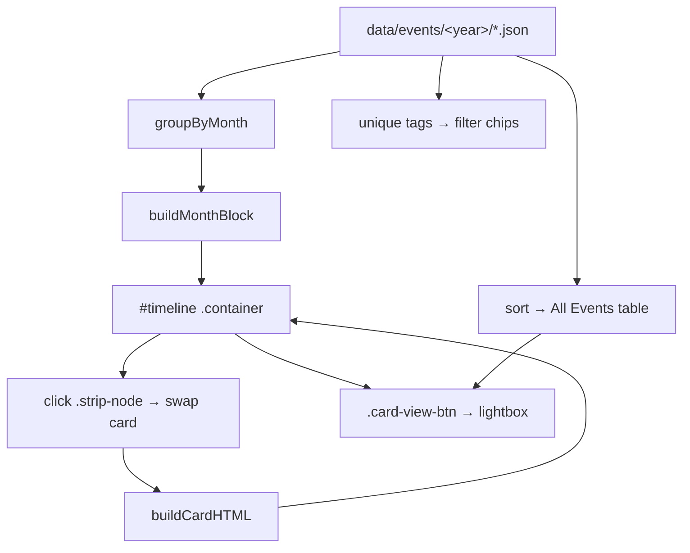

# Event System — NSS TSEC Mumbai Website

Deep dive into `events.html`, `events-timeline.js`/`.css`, and the homepage `events-calendar.js`/`.css`. Covers the data schema, rendering logic, and how to add new events.

---

## 1. Two Event Views

The project has **two event renderers** that now share a **single data source** (the `data/`
folder loaded by `data.js`):

| View | File(s) | Where shown | Data source |
| --- | --- | --- | --- |
| **Timeline** (primary) | `events.html` + `events-timeline.js` / `events-timeline.css` | Events page | `data/events/2025-26/` + `data/events/2026-27/` |
| **Calendar** (archive, hidden) | `index.html` + `events-calendar.js` / `events-calendar.css` | Homepage "2025-26" tab (currently `display: none`) | `data/events/2025-26/` (same as timeline) |

> **Current state (Session 5):** event data lives in one place — `data/events/<year>/*.json`,
> edited through the CMS admin. The timeline, calendar, and homepage "Our Events" grid all read
> from it (the grid is derived by `renderHome.js` from the 2026-27 folder). The old duplicated JS
> arrays (`NSS_EVENTS`, `EVENTS_2025_26`, etc.) were removed in Sessions 2–3.

---

## 2. Event Data Schema

### 2.1 Timeline datasets (`events-timeline.js`)
Events are loaded from `data/events/2025-26/` and `data/events/2026-27/` via the shared
`data.js` loader. Each event is one JSON file:

```js
{
  date:  '21 Feb 2026',          // REQUIRED — "DD Mon YYYY" (e.g. "15 Aug 2025")
  title: "Day 2 Hackspark's 2.0",// REQUIRED — event name
  tag:   'Hackathon',            // REQUIRED — category; matched against data/category-icons.json
  venue: 'TSEC',                 // OPTIONAL — shown as "📍 venue"
  photo: 'assets/Events/....jpg' // OPTIONAL — enables lightbox + 📷 indicator in table
}
```

Two academic-year folders:
- `data/events/2025-26/` — **37** events
- `data/events/2026-27/` — **14** events

### 2.2 Category → icon map
**(Session 5)** The icon map is now read from **`data/category-icons.json`** (via the shared
`data.js` loader) so editors can change it in the CMS and it takes effect immediately. A built-in
default (`DEFAULT_CATEGORY_ICON`, `events-timeline.js`) covers the known tags if the data is
empty/unavailable:
```js
{ 'hackathon':'💻', 'health drive':'❤️', 'cultural event':'🎭', 'awareness':'📢',
  'seminar':'🎓', 'event series':'🗓️', 'patriotic event':'🇮🇳', 'sports':'🏅',
  'environment':'🌱', 'rally':'📣', 'ceremony':'🏆', 'celebration':'🎉', 'orientation':'🎯' }
```
Fallback icon `📌` for unknown tags (`getCategoryIcon`, `events-timeline.js`). Both
`events-timeline.js` and `events-calendar.js` use this data-driven map.

### 2.3 Calendar dataset (`events-calendar.js`)
**(Session 3)** The old duplicated `EVENTS_2025_26` array was **deleted**. The calendar now
reads the **same** `data/events/2025-26/` folder as the timeline via `window.NSS.getEvents('2025-26')`
(`events-calendar.js:60-66`), filtered to entries with a parseable `date`. There is no longer
any duplicated event data in the codebase.

---

## 3. Timeline Rendering Logic (`events.html`)

### 3.1 Structure of the page
```html
<section class="timeline-hero">…</section>          <!-- Title -->
<section class="academic-year-selector">…</section>  <!-- 2025-26 / 2026-27 tabs -->
<section id="filter-bar">…</section>                <!-- search + chips -->
<section id="timeline">…</section>                  <!-- JS-injected month blocks -->
<section id="all-events-section">…</section>        <!-- JS-injected table -->
<div id="lightbox">…</div>                          <!-- image modal -->
```

### 3.2 Render pipeline
1. `DOMContentLoaded` → `loadEventsData()` fetches both years via `window.NSS.getEvents()`,
   then `renderAcademicYear(NSS_EVENTS)` runs with the 2025-26 dataset (`events-timeline.js:311-317`).
2. `groupByMonth(events)` returns `Map<"Month YYYY", events[]>` (`events-timeline.js:109`).
3. For each month, `buildMonthBlock(...)` (`events-timeline.js:144`) emits a `.month-block` containing:
   - a `.month-heading` ("September 2026") + event-count badge,
   - a horizontal `.strip-track` of `.strip-node` buttons (dot + tick + date + title),
   - a `.month-event-display` featuring the first event's card (`buildCardHTML`, `events-timeline.js:124`).
4. All blocks are joined and assigned to `#timeline .container` via `innerHTML` (`events-timeline.js:194`).
5. Filter chips are rebuilt from unique tags (`events-timeline.js:201`).
6. The **All Events table** is rebuilt, sorted newest-first; rows after index 4 are hidden behind a "View Complete List" toggle (`events-timeline.js:219-288`).

### 3.3 Interactivity
- **Academic-year tabs**: re-render with the chosen dataset (`events-timeline.js:331-335`).
- **Category chips / search**: `applyFilters()` (`events-timeline.js:292`) hides empty month blocks and dims (opacity 0.2) non-matching nodes. Search matches title, tag, or date.
- **Node click** (event delegation, `events-timeline.js:399`): swaps the featured card content with a fade-out/fade-in transition.
- **Lightbox** (`events-timeline.js:436`): opened by `.card-view-btn` or `.table-event-link.has-photo`; closes on backdrop click, close button, or `Escape`.

### 3.4 Timeline styles
`events-timeline.css`:
- The thin horizontal rail is `.strip-track::before` (`events-timeline.css:308`).
- Nodes are 120px wide dots; active node gets a red glow (`events-timeline.css:393`).
- `.cal-event-card` has a red accent stripe on the left (`events-timeline.css:458`).
- Sticky filter bar (`events-timeline.css:111`), responsive + reduced-motion overrides.

---

## 4. Calendar Rendering Logic (homepage archive)

`events-calendar.js` is wrapped in an IIFE (`'use strict'`) and bounded to July 2025 → February 2026 (`events-calendar.js:71-72`).

### 4.1 Pipeline
1. `initTabSystem()` (`events-calendar.js:91`) wires `.events-tab-btn` ↔ `.events-tab-pane`.
2. `initCalendarWidget()` (`events-calendar.js:121`) binds prev/next month arrows.
3. `renderCalendarGrid()` (`events-calendar.js:167`):
   - disables prev/next arrows at range edges,
   - updates the month label,
   - renders empty padding cells for the leading weekday offset,
   - builds one `.calendar-day-cell` per day; days with events get `.has-event` + a click listener,
   - auto-selects the first day with events, else shows an empty state.
4. `renderEventDetails()` (`events-calendar.js:266`) fills the right detail pane (image, category, title, "View Full Photo").
5. `openHomeLightbox()` (`events-calendar.js:326`) creates a shared lightbox on the homepage.

### 4.2 Date parsing
`parseEventDate("15 Aug 2025")` → `{ day: 15, monthIndex: 7, year: 2025 }` (`events-calendar.js:371`).

---

## 5. How to Add a New Event

**(Session 5)** Events no longer live in JS arrays. They are stored as one JSON file per event
in `data/events/<year>/` and edited through the CMS admin (`/admin/`) or directly in the JSON.
The timeline, chips, calendar, and table all update automatically on reload.

### 5.1 Timeline (events page)
1. **Recommended (non-technical):** use the CMS — Admin → **Events** → choose the academic-year
   folder → **New entry**. Fill in title, date (`DD MMM YYYY`), category/tag, optional venue and
   photo, then **Save**. See `docs/ADMIN_GUIDE.md`.
2. **Direct (technical):** add a JSON file to `data/events/2025-26/` (or `2026-27/`) matching the
   schema in `docs/DATA_SCHEMA.md`, e.g.:
   ```json
   { "title": "New Drive", "date": "05 Oct 2026", "tag": "Environment", "venue": "Juhu",
     "photo": "assets/Events/new-drive.jpg", "order": 10 }
   ```
   Keep the filename slugged (e.g. `new-drive.json`) and add it to the offline fallback manifest
   (`eventsManifest` in `data.js`) so it also renders when offline.
3. If it's a **new category**, add a key in `data/category-icons.json` (Admin → **Category
   Icons**) so it gets an icon and a filter chip.

### 5.2 Calendar (homepage archive)
The homepage calendar reads the **same** `data/events/2025-26/` folder as the timeline (no
duplication — see `events-calendar.js`).

### 5.3 Homepage "Our Events" grid
The home grid cards are **derived** from the 2026-27 events (`data/events/2026-27/`) by
`renderHome.js`, so adding a matching 2026-27 event updates the grid automatically. Card display
titles/labels are curated in `HOME_CARDS` in `renderHome.js`.

---

## 6. Data Flow Diagram



---

## 7. Common Pitfalls

- **Date format must be `"DD Mon YYYY"`** with 3-letter month (`Aug`, `Sep`) — both `groupByMonth` (`events-timeline.js:115`) and `parseEventDate` (`events-calendar.js:377`) depend on it.
- `applyFilters` relies on `ev.tag.toLowerCase()` matching the chip `data-tag` (`events-timeline.js:314`).
- The 2026-27 event `helping-traffic-management-in-visarjan.json` uses `tag: 'Social Service'`
  (`data/events/2026-27/helping-traffic-management-in-visarjan.json`). That tag has **no entry in
  `data/category-icons.json`** and is **not** one of the `select` options in `admin/config.yml`, so:
  - it falls back to the 📌 icon (`getCategoryIcon`, `events-timeline.js:28-30`), and
  - it still gets its own filter chip, because the chip builder uses the unique tags of the active
    dataset (`events-timeline.js:159`). [Assumption: intended behavior — the tag renders fine, just
    with the default pin icon. To give it a real icon, add a `"social service"` key to
    `data/category-icons.json` and a `"Social Service"` option to both event collections in
    `admin/config.yml`.]
