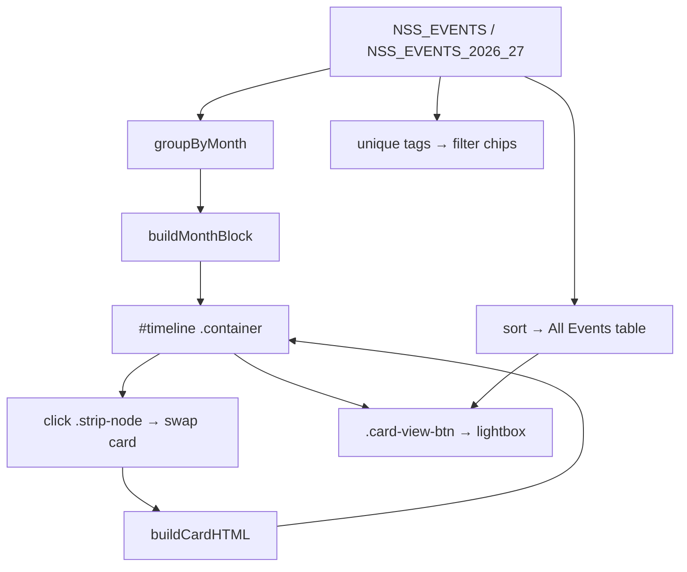

# Event System — NSS TSEC Mumbai Website

Deep dive into `events.html`, `events-timeline.js`/`.css`, and the homepage `events-calendar.js`/`.css`. Covers the data schema, rendering logic, and how to add new events.

---

## 1. Two Event Views

The project has **two independent event renderers** with **separate, duplicated datasets**:

| View | File(s) | Where shown | Data source |
| --- | --- | --- | --- |
| **Timeline** (primary) | `events.html` + `events-timeline.js` / `events-timeline.css` | Events page | `NSS_EVENTS`, `NSS_EVENTS_2026_27` |
| **Calendar** (archive, hidden) | `index.html` + `events-calendar.js` / `events-calendar.css` | Homepage "2025-26" tab (currently `display: none`) | `EVENTS_2025_26` |

> **Important:** The homepage "Our Events" grid in `index.html:219-339` is also hardcoded HTML (separate from both JS datasets). This means **event data exists in three places** — see [docs/IMPROVEMENTS.md](docs/IMPROVEMENTS.md) for the maintenance risk.

---

## 2. Event Data Schema

### 2.1 Timeline datasets (`events-timeline.js`)
Defined as arrays of plain objects:

```js
{
  date:  '21 Feb 2026',          // REQUIRED — "DD Mon YYYY" (e.g. "15 Aug 2025")
  title: "Day 2 Hackspark's 2.0",// REQUIRED — event name
  tag:   'Hackathon',            // REQUIRED — category; matched against CATEGORY_ICON
  venue: 'TSEC',                 // OPTIONAL — only in NSS_EVENTS_2026_27; shown as "📍 venue"
  photo: 'assets/Events/....jpg' // OPTIONAL — enables lightbox + 📷 indicator in table
}
```

Two arrays:
- `NSS_EVENTS` — academic year **2025-26** (38 events) — `events-timeline.js:28`
- `NSS_EVENTS_2026_27` — academic year **2026-27** (14 events) — `events-timeline.js:84`

### 2.2 Category → icon map
`CATEGORY_ICON` (`events-timeline.js:7`):
```js
{ 'hackathon':'💻', 'health drive':'❤️', 'cultural event':'🎭', 'awareness':'📢',
  'seminar':'🎓', 'event series':'🗓️', 'patriotic event':'🇮🇳', 'sports':'🏅',
  'environment':'🌱', 'rally':'📣', 'ceremony':'🏆', 'celebration':'🎉', 'orientation':'🎯' }
```
Fallback icon `📌` for unknown tags (`getCategoryIcon`, `events-timeline.js:23`).

### 2.3 Calendar dataset (`events-calendar.js`)
Same shape plus an always-present `photo` (defaults to a placeholder): `EVENTS_2025_26` (`events-calendar.js:30`). It is effectively the same 2025-26 data as `NSS_EVENTS` but duplicated.

---

## 3. Timeline Rendering Logic (`events.html`)

### 3.1 Structure of the page
```html
<section class="timeline-hero">…</section>          <!-- Title -->
<section class="academic-year-selector">…</section>  <!-- 2025-26 / 2026-27 tabs -->
<section id="filter-bar">…</section>                <!-- search + chips -->
<section id="timeline">…</section>                  <!-- JS-injected month blocks -->
<section id="all-events-section">…</section>        <!-- JS-injected table -->
<div id="lightbox">…</div>                          <!-- image modal -->
```

### 3.2 Render pipeline
1. `DOMContentLoaded` → `renderAcademicYear(NSS_EVENTS)` (`events-timeline.js:350`).
2. `groupByMonth(events)` returns `Map<"Month YYYY", events[]>` (`events-timeline.js:109`).
3. For each month, `buildMonthBlock(...)` (`events-timeline.js:144`) emits a `.month-block` containing:
   - a `.month-heading` ("September 2026") + event-count badge,
   - a horizontal `.strip-track` of `.strip-node` buttons (dot + tick + date + title),
   - a `.month-event-display` featuring the first event's card (`buildCardHTML`, `events-timeline.js:124`).
4. All blocks are joined and assigned to `#timeline .container` via `innerHTML` (`events-timeline.js:194`).
5. Filter chips are rebuilt from unique tags (`events-timeline.js:201`).
6. The **All Events table** is rebuilt, sorted newest-first; rows after index 4 are hidden behind a "View Complete List" toggle (`events-timeline.js:219-288`).

### 3.3 Interactivity
- **Academic-year tabs**: re-render with the chosen dataset (`events-timeline.js:356`).
- **Category chips / search**: `applyFilters()` (`events-timeline.js:292`) hides empty month blocks and dims (opacity 0.2) non-matching nodes. Search matches title, tag, or date.
- **Node click** (event delegation, `events-timeline.js:399`): swaps the featured card content with a fade-out/fade-in transition.
- **Lightbox** (`events-timeline.js:436`): opened by `.card-view-btn` or `.table-event-link.has-photo`; closes on backdrop click, close button, or `Escape`.

### 3.4 Timeline styles
`events-timeline.css`:
- The thin horizontal rail is `.strip-track::before` (`events-timeline.css:308`).
- Nodes are 120px wide dots; active node gets a red glow (`events-timeline.css:393`).
- `.cal-event-card` has a red accent stripe on the left (`events-timeline.css:458`).
- Sticky filter bar (`events-timeline.css:111`), responsive + reduced-motion overrides.

---

## 4. Calendar Rendering Logic (homepage archive)

`events-calendar.js` is wrapped in an IIFE (`'use strict'`) and bounded to July 2025 → February 2026 (`events-calendar.js:71-72`).

### 4.1 Pipeline
1. `initTabSystem()` (`events-calendar.js:91`) wires `.events-tab-btn` ↔ `.events-tab-pane`.
2. `initCalendarWidget()` (`events-calendar.js:121`) binds prev/next month arrows.
3. `renderCalendarGrid()` (`events-calendar.js:167`):
   - disables prev/next arrows at range edges,
   - updates the month label,
   - renders empty padding cells for the leading weekday offset,
   - builds one `.calendar-day-cell` per day; days with events get `.has-event` + a click listener,
   - auto-selects the first day with events, else shows an empty state.
4. `renderEventDetails()` (`events-calendar.js:266`) fills the right detail pane (image, category, title, "View Full Photo").
5. `openHomeLightbox()` (`events-calendar.js:326`) creates a shared lightbox on the homepage.

### 4.2 Date parsing
`parseEventDate("15 Aug 2025")` → `{ day: 15, monthIndex: 7, year: 2025 }` (`events-calendar.js:371`).

---

## 5. How to Add a New Event

### 5.1 Timeline (events page) — recommended
1. Add an image to `assets/Events/` (optional).
2. In `events-timeline.js`, push an object to the correct array:
   - For **2025-26**: `NSS_EVENTS` (`events-timeline.js:28`).
   - For **2026-27**: `NSS_EVENTS_2026_27` (`events-timeline.js:84`).
   ```js
   { date: '05 Oct 2026', title: 'New Drive', tag: 'Environment', venue: 'Juhu', photo: 'assets/Events/new-drive.jpg' }
   ```
3. If it's a new category, add it to `CATEGORY_ICON` (`events-timeline.js:7`) so it gets an icon and a filter chip.

The timeline, chips, and table all update automatically on reload.

### 5.2 Calendar (homepage archive)
Edit `EVENTS_2025_26` in `events-calendar.js:30` (same schema). Note this duplicates timeline data.

### 5.3 Homepage "Our Events" grid
Edit the `.event-card` blocks in `index.html:219-339` (hardcoded HTML — no JS).

---

## 6. Data Flow Diagram



---

## 7. Common Pitfalls

- **Date format must be `"DD Mon YYYY"`** with 3-letter month (`Aug`, `Sep`) — both `groupByMonth` (`events-timeline.js:115`) and `parseEventDate` (`events-calendar.js:377`) depend on it.
- `applyFilters` relies on `ev.tag.toLowerCase()` matching the chip `data-tag` (`events-timeline.js:314`).
- The 2026-27 dataset uses `tag: 'Social Service'` once (`events-timeline.js:87`); since that tag has no icon entry it falls back to 📌 — and no chip is generated for it because the chip builder uses `NSS_EVENTS_2026_27` tags, so "Social Service" *will* get a chip (built from the active dataset). [Assumption: intended behavior.]
