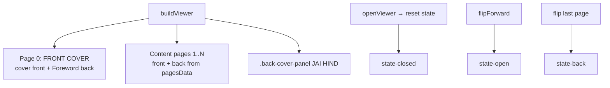

# Interactive 3D Magazine Viewer

The NSS magazine is a **custom, from-scratch, fullscreen 3D book viewer** — it does not use any 3D library. It is built with **CSS 3D transforms** (`transform-style: preserve-3d`, `rotateY`) plus vanilla JS state machines and event handling. Files: `magazine.js` and `magazine.css`.

---

## 1. How It's Triggered

The homepage contains two `.magazine-card` cover cards (`index.html:407,417`) inside a **currently hidden** `#magazine` section (`index.html:398`, `style="display: none;"` — marked "do not delete").

`magazine.js:383` attaches a `click` listener to every `.magazine-card` that calls `openViewer()`.

---

## 2. Runtime DOM Construction

The entire viewer is **built lazily on first open** by `buildViewer()` (`magazine.js:46`) and appended to `<body>`. Its structure:

```
.book-overlay#magazine-viewer
├── button.book-close
├── .book-wrapper
│   └── .book-container#book-container   (state-closed | state-open | state-back)
│       ├── .book-page-left#book-left          ← shows back-face of last flipped page
│       ├── .book-page-right-area#book-right   ← contains the flippable pages
│       │   └── .book-page[data-index=N] × (cover + content pages)
│       ├── .book-spine-glow
│       └── .back-cover-panel                  ← "JAI HIND"
└── nav.book-nav  (prev / next buttons)
```

### Page composition
Each `.book-page` has two faces:
- `.page-front` — right-hand face (default visible).
- `.page-back` — rotated `180deg` (`magazine.css:314`), hidden by `backface-visibility: hidden`.



---

## 3. The Page-Flip Mechanics

### 3.1 CSS 3D setup
- `.book-container` uses `transform-style: preserve-3d` and transitions `width` (`magazine.css:186-192`).
- `.book-page` has `transform-origin: left center`, `transition: transform 0.7s ease-in-out` (`magazine.css:285-291`).
- Flipping = adding `.flipped` → `transform: rotateY(-180deg)` (`magazine.css:295-297`).

### 3.2 Book states (width changes)
| State | Width | Meaning |
| --- | --- | --- |
| `state-closed` | 410px (`magazine.css:195`) | Only the cover is visible; right area = 100%. |
| `state-open` | 820px (`magazine.css:201`) | Two-page spread; right area = 50%, left page visible. |
| `state-back` | 410px (`magazine.css:207`) | Only the back cover ("JAI HIND") visible; right area = 0. |

State transitions are pure class swaps in `transitionToOpen/Back/Closed` (`magazine.js:158-185`).

### 3.3 JS state machine (`magazine.js`)
```js
let currentFlip = 0;          // next page index to flip
let isOpened   = false;       // cover flipped open?
let isAtBack   = false;       // showing back cover?
function getTotalFlippable() { return pagesData.length + 1; } // cover + content pages
```
- **(Session 5 fix)** `totalFlippable` was originally a `const` computed once at parse time when
  `pagesData` was still empty, so it always equalled `1` and the magazine could never flip past
  the cover. It is now derived live via `getTotalFlippable()` from the loaded `pagesData`.
- `flipForward()` (`magazine.js:191`): flips the page at `currentFlip`, increments, updates the left-page content, and transitions to `state-back` when the last page flips.
- `flipBackward()` (`magazine.js:220`): reverses the flip and returns to `state-closed` when back at the cover.
- `updateLeftContent()` (`magazine.js:118`): copies the `innerHTML` of the last flipped page's `.page-back` into the static `.book-page-left`.

### 3.4 Input methods (`attachEvents`, `magazine.js:287`)
- **Click** a non-flipped page → `flipForward`; click left page → `flipBackward`.
- **Buttons** `.book-prev` / `.book-next`.
- **Keyboard**: `Escape` (close), `ArrowRight` (forward), `ArrowLeft` (backward) — `magazine.js:307`.
- **Drag / swipe**: `setupDrag()` (`magazine.js:323`) tracks mouse/touch `mousedown→mousemove→mouseup` (and touch equivalents), live-rotating the page with `rotateY(angle)` where `angle = -dx / 2.5` clamped to `[-180, 0]`. Releasing past a `dx` threshold (70px mouse / 50px touch) triggers `flipForward`.
- **Overlay backdrop click** closes the viewer.

### 3.5 Reduced motion
`magazine.css:543` disables page/container/nav transitions under `prefers-reduced-motion: reduce`.

---

## 4. Content Data (`pagesData`)

Defined at `magazine.js:10` as an array of content-page objects (the cover and back cover are generated separately):

```js
const pagesData = [
  {
    front: { img: 'assets/photos/hero_1.jpg', title: 'Beach Cleaning Drive', desc: '...' },
    back:  { img: 'assets/photos/hero_2.jpg', title: 'Independence Day Rally', desc: '...' }
  },
  { /* page 2 */ }
];
```

- Page 0 (cover) is hardcoded in `buildViewer` (`magazine.js:54`): cover front (photo + logo + "NSS MAGAZINE") and a "Foreword" on its back.
- The **last** content page's back face renders a "JAI HIND" splash instead of content (`magazine.js:86-93`), as does the standalone `.back-cover-panel`.

---

## 5. How to Add / Edit Pages

1. **Add a content page:** push a new `{ front: {...}, back: {...} }` object to `pagesData` (`magazine.js:10`).
2. **Edit text/images:** change the `img`, `title`, `desc` values (point `img` to files under `assets/photos/`).
3. **Page numbering** is derived automatically: front page = `(i+1)*2`, back page = `(i+1)*2 + 1` (`magazine.js:83,92`).
4. `totalFlippable` and the flip states adapt automatically because they're computed from `pagesData.length`.

No CSS changes are required unless you add a new page type.

---

## 6. Key Files & References

| Concern | File : line |
| --- | --- |
| Content data | `magazine.js:10` |
| Viewer DOM builder | `magazine.js:46` |
| Flip state machine | `magazine.js:158-247` |
| Drag/swipe logic | `magazine.js:323` |
| Card → open binding | `magazine.js:383` |
| Book/state CSS | `magazine.css:186-297` |
| Face/paper/cover CSS | `magazine.css:303-478` |
| Responsive book sizing | `magazine.css:524-540` |

---

## 7. Notes / Caveats

- The magazine **section is hidden** on the homepage (`index.html:398`), so the viewer is currently only reachable via the cover cards if the section is un-hidden. [Assumption: it will be re-enabled for the annual edition launch.]
- The viewer is desktop-first; mobile sizes are reduced but still usable (`magazine.css:532`).
- The paper texture is an inline SVG data-URI (`magazine.css:325`).
