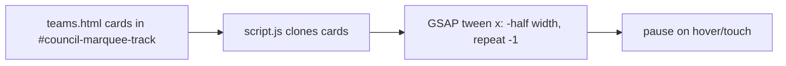
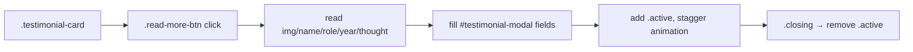

# Teams & Testimonials — NSS TSEC Mumbai Website

How the **Teams** page (`teams.html` + `style.css` + `script.js`) and the **Testimonials** page (`testimonials.html` + `testimonials.js` + `testimonials.css`) are structured and rendered.

---

## 1. Teams Page (`teams.html`)

The page is **entirely static HTML** (no team-data array). It is organized into several visual groups, all using the shared `.team-card` component.

### 1.1 Sections (top → bottom)

| Section | Element / class | Members | Display |
| --- | --- | --- | --- |
| Faculty Advisors | `.faculty-grid` | 3 (Principal + 2 Programme Officers) | Flex row of `.team-card` |
| Faculty (5-frame) | `.five-frame-grid` | 5 faculty | Flex row of `.team-card` |
| NSS Leadership | `.leadership-row` | 5 leaders (Youth Presidents, Tech Head, etc.) | Flex row of `.leader-card-large` |
| NSS Council | `.marquee-slideshow-track` | 15 council members | **Infinite marquee slideshow** |
| Core Committee 2026-27 | `.core-committee-table` | 5 core + 15 council | HTML `<table>` |

### 1.2 The `.team-card` component
Each card has:
```html
<div class="team-card">
  <div class="team-card-inner">        <!-- 3D tilt on hover, style.css:646 -->
    <div class="team-img-container">
      
      <div class="team-hover-overlay">  <!-- dark blur overlay on hover -->
        <span class="hover-word">quote</span>   <!-- Great Vibes cursive -->
      </div>
    </div>
  </div>
  <div class="team-info">
    <h4>Name</h4>
    <p>Role</p>
  </div>
</div>
```
- Hover: image zooms (`style.css:676`), overlay fades in with a cursive quote (`style.css:680-716`).
- Cards have `perspective: 1000px` and a subtle 3D rotate on hover (`style.css:640,658`).

### 1.3 Council marquee slideshow (JS-driven)
`script.js:326-355` powers the infinite slideshow:
1. Clones all `.team-card` children of `#council-marquee-track` to create a seamless loop (`script.js:331`).
2. Tweens the track with GSAP: `x: () => -track.scrollWidth / 2`, `duration: 35`, `repeat: -1`, `ease: "none"` (`script.js:338`).
3. Pauses on `mouseenter`/`touchstart` and resumes on `mouseleave`/`touchend` (`script.js:349-354`).

The track is a `display: flex; width: max-content` container (`style.css:827`) inside an `overflow: hidden` wrapper.

### 1.4 Core Committee table
A plain HTML `<table>` (`teams.html:550`) with:
- A navy header row (`style.css:968`),
- `.core-member` rows styled bold (`style.css:997`),
- A `.table-divider` row separating core from council (`teams.html:581`).

### 1.5 Animation
On load, `script.js:316` animates all `.team-card`s to full opacity/scale with `gsap.to(..., stagger: 0.05, ease: 'back.out(1.7)')`. Note `.leader-card-large` and `.slide-card` override the default `opacity: 0` via `!important` (`style.css:776,837`) so they stay visible for the marquee.

> **Placeholder images:** Most leadership and council cards use `https://placehold.co/400x500` (e.g. `teams.html:205`). Only the Principal (`pricipal.png.png`) and Programme Officer (`po.png.png`) have real photos. [To be verified: whether real photos are pending.]

---

## 2. Testimonials Page (`testimonials.html`)

Also **static HTML** — no data array. Seven `.testimonial-card`s are hardcoded in the `.testimonials-grid`.

### 2.1 Card structure
```html
<div class="testimonial-card">
  <div class="card-image">
    
    <div class="card-overlay">
      <span class="volunteer-role">Volunteer</span>
      <span class="volunteer-year">Batch 2025-26</span>
    </div>
  </div>
  <div class="card-info">
    <h3 class="volunteer-name">Tirtha Pawar</h3>
    <p class="volunteer-thought">"..."</p>
    <button class="read-more-btn" data-id="1">Read More</button>
  </div>
</div>
```

### 2.2 Rendering / styling
- Grid: `repeat(auto-fill, minmax(300px, 1fr))` (`testimonials.css:44`).
- Avatar is circular (`.card-image`, 120px, `testimonials.css:70`); hover reveals role/year overlay and zooms the image.
- The visible quote is clamped to 2 lines via `-webkit-line-clamp: 2` (`testimonials.css:144-155`).

### 2.3 GSAP entrance (`testimonials.js`)
- Hero title/subtitle intro timeline (`testimonials.js:11-22`).
- Staggered card reveal on scroll (`testimonials.js:25-35`).

### 2.4 Modal system (`testimonials.js:37-98`)
A single reusable modal (`#testimonial-modal`, `testimonials.html:213`) is filled from the clicked card:

```js
const img     = card.querySelector('.card-image img').src;
const name    = card.querySelector('.volunteer-name').innerText;
const role    = card.querySelector('.volunteer-role').innerText;
const year    = card.querySelector('.volunteer-year').innerText;
const thought = card.querySelector('.volunteer-thought').innerText;
```
(`testimonials.js:54-58`). It populates `#modal-img`, `#modal-name`, `#modal-role-year`, `#modal-thought`, then activates the modal.

Modal features:
- CSS staggered entrance via `.modal-animate-el` + `.stagger-1..5` (`testimonials.css:346-363`).
- Smooth closing: adds `.closing`, waits 250ms, removes `.active` (`testimonials.js:74-82`).
- Closes on close button, overlay click, or `Escape` (`testimonials.js:84-98`).

---

## 3. How to Add Members / Testimonials

### 3.1 Add a team member (Teams page)
1. Add a `.team-card` block in the appropriate section of `teams.html` (copy an existing one).
2. Update the ``, `alt`, name (`<h4>`), and role (`<p>`).
3. Optionally add a quote in `.hover-word`.
4. If adding to the council, also add a row to the `.core-committee-table` if desired.

### 3.2 Add a testimonial (Testimonials page)
1. Add a `.testimonial-card` block in `.testimonials-grid` (copy an existing one).
2. Set the avatar image, name, role, year, thought text, and a unique `data-id` on the button.
3. No JS changes required — the modal reads whatever is in the card.

---

## 4. Data Flow Diagrams

### 4.1 Teams marquee


### 4.2 Testimonials modal

